

<div class="MCWHeader1">
Azure Resource Manager
</div>

<div class="MCWHeader2">
Hands-on lab step-by-step
</div>

<div class="MCWHeader3">
June 2018
</div>


Information in this document, including URL and other Internet Web site references, is subject to change without notice. Unless otherwise noted, the example companies, organizations, products, domain names, e-mail addresses, logos, people, places, and events depicted herein are fictitious, and no association with any real company, organization, product, domain name, e-mail address, logo, person, place or event is intended or should be inferred. Complying with all applicable copyright laws is the responsibility of the user. Without limiting the rights under copyright, no part of this document may be reproduced, stored in or introduced into a retrieval system, or transmitted in any form or by any means (electronic, mechanical, photocopying, recording, or otherwise), or for any purpose, without the express written permission of Microsoft Corporation.

Microsoft may have patents, patent applications, trademarks, copyrights, or other intellectual property rights covering subject matter in this document. Except as expressly provided in any written license agreement from Microsoft, the furnishing of this document does not give you any license to these patents, trademarks, copyrights, or other intellectual property.

The names of manufacturers, products, or URLs are provided for informational purposes only and Microsoft makes no representations and warranties, either expressed, implied, or statutory, regarding these manufacturers or the use of the products with any Microsoft technologies. The inclusion of a manufacturer or product does not imply endorsement of Microsoft of the manufacturer or product. Links may be provided to third party sites. Such sites are not under the control of Microsoft and Microsoft is not responsible for the contents of any linked site or any link contained in a linked site, or any changes or updates to such sites. Microsoft is not responsible for webcasting or any other form of transmission received from any linked site. Microsoft is providing these links to you only as a convenience, and the inclusion of any link does not imply endorsement of Microsoft of the site or the products contained therein.
© 2018 Microsoft Corporation. All rights reserved.

Microsoft and the trademarks listed at https://www.microsoft.com/en-us/legal/intellectualproperty/Trademarks/Usage/General.aspx are trademarks of the Microsoft group of companies. All other trademarks are property of their respective owners.

**Contents**

<!-- TOC -->

- [Azure Resource Manager hands-on lab step-by-step](#azure-resource-manager-hands-on-lab-step-by-step)
    - [Abstract and learning objectives](#abstract-and-learning-objectives)
    - [Overview](#overview)
    - [Solution architecture](#solution-architecture)
    - [Help references](#help-references)
    - [Exercise 1: Configure Automation Account](#exercise-1-configure-automation-account)
        - [Task 1: Create Automation Account](#task-1-create-automation-account)
        - [Task 2: Add an Azure Automation credential](#task-2-add-an-azure-automation-credential)
        - [Task 3: Upload DSC Configurations into Automation Account](#task-3-upload-dsc-configurations-into-automation-account)
    - [Exercise 2: Define the network foundation](#exercise-2-define-the-network-foundation)
        - [Task 1: Deploy a virtual network with a template](#task-1-deploy-a-virtual-network-with-a-template)
    - [Exercise 3: Extend with Compute](#exercise-3-extend-with-compute)
        - [Task 1: Add an Azure storage account](#task-1-add-an-azure-storage-account)
        - [Task 2: Add a virtual machine and configure as a web server](#task-2-add-a-virtual-machine-and-configure-as-a-web-server)
        - [Task 3: Add a Windows virtual machine for the database server](#task-3-add-a-windows-virtual-machine-for-the-database-server)
        - [Task 4: Deploy your updated template to Azure](#task-4-deploy-your-updated-template-to-azure)
    - [Exercise 4: Lock down the environment](#exercise-4-lock-down-the-environment)
        - [Task 1: Restrict traffic to the web server](#task-1-restrict-traffic-to-the-web-server)
        - [Task 2: Update the network security group to allow Windows Remote Desktop](#task-2-update-the-network-security-group-to-allow-windows-remote-desktop)
    - [Exercise 5: Scale out the deployment](#exercise-5-scale-out-the-deployment)
        - [Task 1: Parameterize and scale out the environment](#task-1-parameterize-and-scale-out-the-environment)
    - [After the hands-on lab](#after-the-hands-on-lab)
        - [Task 1: Delete the resource groups created](#task-1-delete-the-resource-groups-created)

<!-- /TOC -->

# Azure Resource Manager hands-on lab step-by-step

## Abstract and learning objectives 

In this hands-on lab, you will learn how to author an Azure Resource
Manager (ARM) template that can be used to deploy infrastructure such as
virtual machine, storage, and networking. This lab will also teach 
you how to deploy virtual machines that are automatically
configured by the Azure Automation Desired State Configuration (DSC)
service.

-   How to author and deploy an ARM template

-   How to perform configuration management with Azure Automation DSC

## Overview

Contoso has asked you to define an Azure Resource Manager (ARM) template
that can deploy their application CloudShop and its associated database
using Azure Virtual Machines.

## Solution architecture


## Help references

|    |            |
|----------|:-------------:|
| **Description** | **Links** |
| Creating and deploying Azure resource groups through Visual Studio | https://docs.microsoft.com/en-us/azure/azure-resource-manager/vs-azure-tools-resource-groups-deployment-projects-create-deploy | 
| Azure Quick Start Templates | <https://azure.microsoft.com/en-us/resources/templates/> |
| Using Managed Disks with Templates | <https://docs.microsoft.com/en-us/azure/virtual-machines/windows/using-managed-disks-template-deployments> |
| Azure VM Scale Sets Templates | <https://docs.microsoft.com/en-us/azure/virtual-machine-scale-sets/virtual-machine-scale-sets-mvss-start> |
| Azure DSC Extension for Virtual Machines | <https://docs.microsoft.com/en-us/azure/virtual-machines/extensions/dsc-template> |
| Azure Virtual Machine Scale Sets | <https://docs.microsoft.com/en-us/azure/virtual-machine-scale-sets/> |
| Azure Virtual Machine Scale Sets and Azure Automation DSC| <https://github.com/Azure/azure-quickstart-templates/tree/master/201-vmss-automation-dsc> |
| App Service for Linux | <https://docs.microsoft.com/en-us/azure/app-service/containers/app-service-linux-intro/> |
| Azure CLI | <https://docs.microsoft.com/en-us/cli/azure/install-azure-cli/> |


## Exercise 1: Configure Automation Account

Duration: 15 minutes

In this exercise, you will create and configure an Azure Automation
Account in the Azure portal before configuring and deploying the
resources of your ARM template.

### Task 1: Create Automation Account

1.  Browse to the Azure portal and authenticate at
    <https://portal.azure.com/>

2.  Click + **Create Resource** and type **Automation** in the search box. Choose **Automation** from the results.

3.  Click **Create** on the Automation blade to display the **Add Automation Account** blade. Specify the following information, and click **Create**:
    
    

### Task 2: Add an Azure Automation credential

1.  The CloudShopSQL DSC configuration requires a credential object to
    access the local administrator account on the virtual machine.
    Within the Azure Automation Account click **Credentials**
    in the **SHARED RESOURCES** section.

    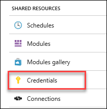

2.  Click the **Add a credential** button

    

3.  Specify the following properties and confirm creation to continue:

    a.  **Name**: SQLLocalAdmin

    b.  **User Name**: demouser

    c.  **Password & Confirm**: demo\@pass123

    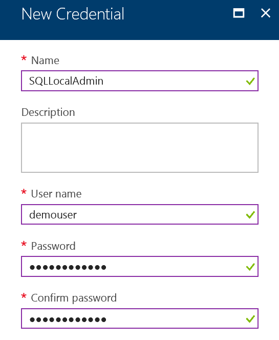

Important: It is important to use the exact name for the credential,
because one of the scripts you upload in the next step references the
name directly.


### Task 3: Upload DSC Configurations into Automation Account

1.  Click **Resource groups \> Automation\_RG \> Automation-Acct**, and click the **State configuration (DSC)** menu.

    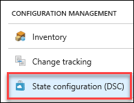

2.  Select the **Configurations** tab.

    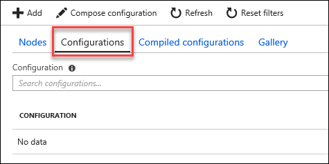

3.  Click **+Add** button to upload **C:\\Hackathon\\CloudShopSQL.ps1** and **C:\\Hackathon\\CloudShopWeb.ps1**.

    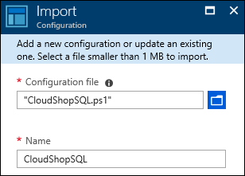   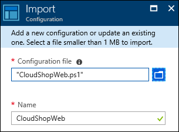

4.  After importing the .ps1 files, click the **CloudShopSQL** DSC
    Configuration and click **Compile** on the toolbar (click **Yes** on
    the Start Compilation Job blade). Do the same for **CloudShopWeb**.
    
    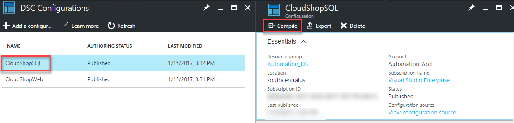


## Exercise 2: Define the network foundation

Duration: 15 minutes

Your first ARM template task is to create a virtual network template
using Visual Studio and deploy it to your Azure account.

### Task 1: Deploy a virtual network with a template

1.  Open Visual Studio. The shortcut should be available on the desktop,
    and if it is not, click the Windows icon in the bottom left corner,
    and type in Visual Studio. You should see the start icon.

2.  Choose **File**, and **New Project**. Then, choose **Cloud**
    followed by **Azure Resource Group**.

3.  Name the project **ARMHackathon**, specify **C:\\Hackathon** for the
    location, and click **OK**

    

4.  On the Select Azure Template dialog box, choose **Blank Template**, and click **OK**

    

5.  In the **Solution Explorer**, open the **azuredeploy.json** under
    the solution

    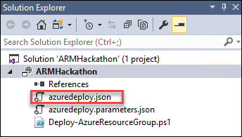

6.  The file should contain four different sections: parameters,
    variables, resources, and outputs. On the left side, a new window
    called **JSON Outline** should have been opened as well.

    

    > Note: If this was not the case, go to the View menu, select Other Windows, and choose JSON Outline. The window should look like the following image.

7.  On the **JSON Outline** window, click **Add Resource** in the upper-left corner or right-click the **resources**, and choose **Add New Resource**.

    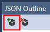

8.  On the **Add Resource** dialog box, choose **Virtual Network**,
    enter **hackathonVnet** in the **Name** field, and click **Add**

    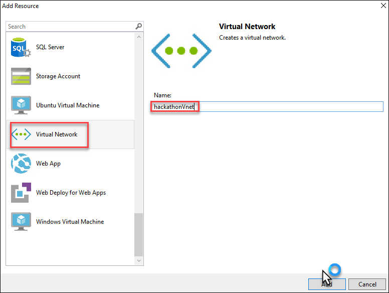

9.  Go to the **azuredeploy.json** file, and inspect its content. Review
    the **variables** section. It should look like the following file.
    ```  
    "variables": {
      "hackathonVnetPrefix": "10.0.0.0/16",
      "hackathonVnetSubnet1Name": "Subnet-1",
      "hackathonVnetSubnet1Prefix": "10.0.0.0/24",
      "hackathonVnetSubnet2Name": "Subnet-2",
      "hackathonVnetSubnet2Prefix": "10.0.1.0/24"
    },
    ```

10. Change the name of **Subnet-1** to **FrontEndNet** as well as the
    name of **Subnet-2** to **DatabaseNet**
    ```
    "hackathonVnetSubnet1Name": "FrontEndNet",
    "hackathonVnetSubnet2Name": "DatabaseNet",
    ```

11. Deploy the template by **right-clicking** the **ARMHackathon**
    project and choosing **Deploy** **\>** **New**

    

12. If you did not sign in to your Microsoft Azure account already, you will be asked to do so now

13. Fill in the email address associated with the Azure account, and click **Continue**

    

14. You might have to choose between a work/school account and a
    Microsoft account. Microsoft account refers to a Live ID account.
    Depending on what kind of account you have, you should choose one or
    the other.

15. Enter your password, and click **Sign In**

    

16. If you have several subscriptions, choose the one that you want your VNet to be deployed to, and on the Resource group, choose **Create New**

    

17. On the Create Resource Group dialog box, accept the default value for the name. For the location, choose the **closest location to you**, and click **Create**

    

18. When you are back on the Deploy to Resource Group dialog box, click
    **Deploy**. After about a minute, your virtual network will be
    deployed to Azure.

    

19. View the created resource group and virtual network in the Azure
    Management Portal by clicking **Resource Groups** and clicking the
    **ARMHackathon**

    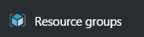

    

    > Note: If the resource group was created but the virtual network was not, redeploy the template once more from Visual Studio.

    You should see an indication of a successful deployment in the **Output** screen.
    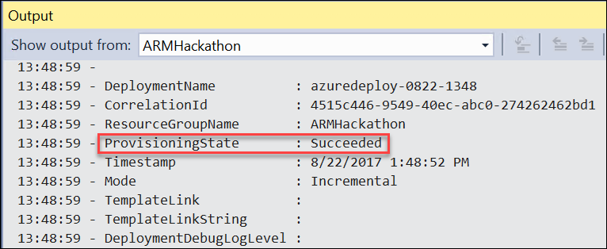

20. To verify the new network was created, within the Azure portal,
    navigate to **Virtual Networks**. Your new network should be listed
    there.

    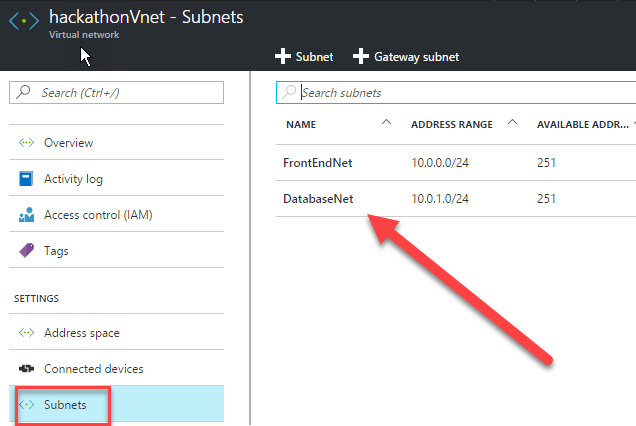

## Exercise 3: Extend with Compute

Duration: 60 minutes

In this exercise, you will continue the work you started in the previous
task by creating a storage account and adding virtual machines for the
web application and database followed by configuring the machines for
the roles.

### Task 1: Add an Azure storage account

1.  On the **JSON Outline** window, click **Add Resource** in the upper-left corner, or right-click the **resources** and choose **Add New Resource**.

    

2.  Add a new **Storage Account** resource to the template named ***hackstorage***

    > Note: The template generated in the Azure SDK appends a unique value (13 characters in length) to the storage account name. Storage account names must not exceed 24 characters. Ensure the name specified is 11 characters or less in length.

    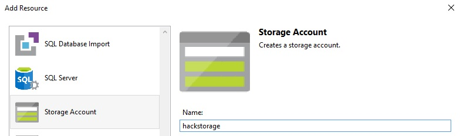

3. Click **Add** to add the storage account to the template

### Task 2: Add a virtual machine and configure as a web server

1.  Add a new **Windows Virtual Machine** called **hackathonVM**, and
    choose ***hackstorage*** as the Storage Account and **FrontEndNet**
    subnet as the Virtual network/subnet. The **FrontEndNet** is the
    value of **hackathonVnetSubnet1Name** variable.

    > Note: The storage account will be changed later to use a new feature called Managed Disks.

    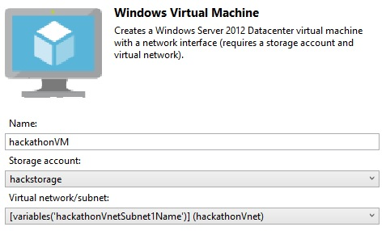

2.  Locate the Parameter **hackathonVMWindowsOSVersion**

    

3.  Replace the code between the start { and stop } brackets with the
    updated code below to allow for the use of Windows Server 2016
    Offerings. Ensure you do not remove either of the { } brackets in
    the process.

    

    Replace the code block with the code below:
    ```
       "type": "string",
       "defaultValue": "2016-Datacenter",
       "allowedValues": [
       "2016-Datacenter"
        ]  
    ```

4.  A **Network Interface** named ***hackathonVMNic*** was automatically
    added to the configuration when the virtual machine resource was
    added to connect the virtual machine to the virtual network. Add a
    Public IP address called ***hackathonPublicIP*** to the
    **hackathonVMNic**. This will allow you to connect to the machine
    using remote desktop client or to access the web server.

    

    > Note: If you inspect the JSON for the NIC, you'll notice that the ipConfigurations were modified to refer to the public IP address just added!

5.  In the JSON outline pane, select the hackathonVM object
    

6.  Visual Studio should have highlighted the JSON that represents the VM object.  Within this JSON code, locate 2 sections of code:

    First, find:
    ```
    "apiVersion": "2015-06-15",
    ```
    Change to:
    ```
    "apiVersion": "2017-03-30",
    ```
    Next, find:

    ```
          "osDisk": {
            "name": "hackathonVMOSDisk",
            "vhd": {
              "uri": "[concat(reference(resourceId('Microsoft.Storage/storageAccounts', variables('hackstorageName')), '2016-01-01').primaryEndpoints.blob, variables('hackathonVMStorageAccountContainerName'), '/', variables('hackathonVMOSDiskName'), '.vhd')]"
            },
            "caching": "ReadWrite",
            "createOption": "FromImage"
          }
    ```
    Replace the code block with the code below:

    ```
            "osDisk": {
                "createOption": "FromImage"
            }
    ```

    This step has changed the VM to use **managed disks** instead of unmanaged disks.

7.  Next you will add the PowerShell DSC Extension to the
    **azuredeploy.json** file. This will register the VM with Azure
    Automation DSC Extension.

    

8.  Change the Type Handler from 2.9 to **2.76**, and make sure that
    autoUpgradeMinorVersion is **false**

    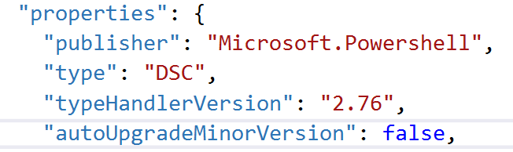


9.  Find the settings code within the PowerShell DSC section you just
    added, and replace it with this code (make sure you do not remove
    the protectedSettings block):

    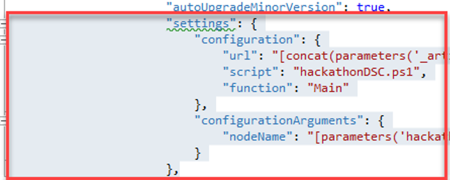
    ```
            "settings": {
              "modulesUrl": "https://cloudworkshop.blob.core.windows.net/arm-hackathon/RegistrationMetaConfigV2.zip",
              "configurationFunction": "RegistrationMetaConfigV2.ps1\\RegistrationMetaConfigV2",
              "Properties": [
               {
                "Name": "RegistrationKey",
                "Value": {
                 "UserName": "PLACEHOLDER_DONOTUSE",
                 "Password": "PrivateSettingsRef:registrationKeyPrivate"
                },
                "TypeName": "System.Management.Automation.PSCredential"
               },
               {
                "Name": "RegistrationUrl",
                "Value": "[parameters('registrationUrl')]",
                "TypeName": "System.String"
               },
               {
                "Name": "NodeConfigurationName",
                "Value": "[parameters('nodeConfigurationName')]",
                "TypeName": "System.String"
               },
               {
                "Name": "ConfigurationMode",
                "Value": "[parameters('configurationMode')]",
                "TypeName": "System.String"
               },
               {
                "Name": "ConfigurationModeFrequencyMins",
                "Value": "[parameters('configurationModeFrequencyMins')]",
                "TypeName": "System.Int32"
               },
               {
                "Name": "RefreshFrequencyMins",
                "Value": "[parameters('refreshFrequencyMins')]",
                "TypeName": "System.Int32"
               },
               {
                "Name": "RebootNodeIfNeeded",
                "Value": "[parameters('rebootNodeIfNeeded')]",
                "TypeName": "System.Boolean"
               },
               {
                "Name": "ActionAfterReboot",
                "Value": "[parameters('actionAfterReboot')]",
                "TypeName": "System.String"
               },
               {
                "Name": "AllowModuleOverwrite",
                "Value": "[parameters('allowModuleOverwrite')]",
                "TypeName": "System.Boolean"
               },
               {
                "Name": "Timestamp",
                "Value": "[parameters('timestamp')]",
                "TypeName": "System.String"
               }
              ]
           },
    ```
8.  Next in the protectedSettings section, delete the
        "configurationUrlSasToken" line; replacing it with this code:
    ```
    "Items": {
        "registrationKeyPrivate": "[parameters('registrationKey')]"
     }
    ```

    Before:
    
    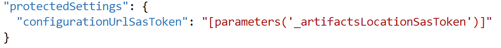

    After:

    


9. You will now append the following parameters to your json template
    (*after the **hackathonPublicIPDnsName** parameter*)
    > Note: A comma "," must be added after the closing curly-brace "}"

    
    ![Screenshot of code, with },\] circled, and the text \"Paste parameter code here, after comma\"highlighted.](images/Hands-onlabstep-by-step-AzureResourceManagerimages/media/image53.png "Code section")
    ```
    "registrationKey": {
       "type": "string",
       "metadata": {
        "description": "Registration key of Automation account"
       }
      },
      "registrationUrl": {
       "type": "string",
       "metadata": {
        "description": "Registration URL of Automation account"
       }
      },
      "nodeConfigurationName": {
       "type": "string",
       "metadata": {
        "description": "Name of configuration to apply"
       }
      },
      "rebootNodeIfNeeded": {
       "type": "bool",
       "metadata": {
        "description": "Reboot if needed"
       }
      },
      "allowModuleOverwrite": {
       "type": "bool",
       "metadata": {
        "description": "Allow Module Overwrite"
       }
      },
      "configurationMode": {
       "type": "string",
       "defaultValue": "ApplyAndMonitor",
       "allowedValues": [
        "ApplyAndMonitor",
        "ApplyOnly",
        "ApplyandAutoCorrect"
       ],
       "metadata": {
        "description": "Configuration Mode"
       }
      },
      "configurationModeFrequencyMins": {
       "type": "int",
       "metadata": {
        "description": "Allow Module Overwrite"
       }
      },
      "refreshFrequencyMins": {
       "type": "int",
       "metadata": {
        "description": "Refresh frequency in minutes"
       }
      },
      "actionAfterReboot": {
       "type": "string",
       "defaultValue": "ContinueConfiguration",
       "allowedValues": [
        "ContinueConfiguration",
        "StopConfiguration"
       ],
       "metadata": {
        "description": "Action after reboot"
       }
      },
      "timestamp": {
       "type": "string",   
       "metadata": {
        "description": "Time stamp MM/dd/YYYY H:mm:ss"
       }
      }
    ```

10. In the "**variables**" section, change the value of
    hackathonVMVmSize\" to \"Standard\_DS1\_v2"

    

11. Save your changes to the **azuredeploy.json** template file

### Task 3: Add a Windows virtual machine for the database server

1.  Add another virtual machine to the template by clicking **Add Resource** and next, selecting **Windows Virtual Machine**

    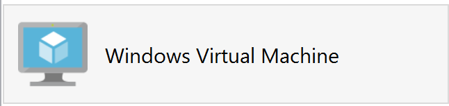

2.  Name this virtual machine resource **hackathonSqlVM**, and reference
    the parameters **hackStorage** and **hackathonVnetSubnet2Name**
    respectively

    

3.  Navigate to the **variables** section, and find the following
    variables:

    

4.  Modify the following **hackathonSqlVMImagePublisher** and
    **hackathonSqlVMImageOffer** variables to the following SQL Server
    image values:

    ```
    "hackathonSqlVMImagePublisher": "MicrosoftSQLServer",
    "hackathonSqlVMImageOffer": "SQL2016SP1-WS2016",
    ```

5.  Find the **hackathonSqlVMWindowsOSVersion** parameter

    

6.  Replace the **hackathonSqlVMWindowsOSVersion** parameter with the following:
    ```
    "hackathonSqlVMSKU": {
          "type": "string",
          "defaultValue": "Web",
          "allowedValues": [
            "Web",
            "Standard",
            "Enterprise"
          ]
        }	
    ```

    

7.  Click the **hackathonSqlVM** resource to move to its properties

    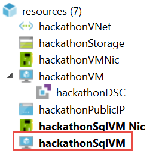

8.  Update the **SKU** property to point to the new parameter: **hackathonSqlVMSKU**

    ```
    "sku": "[parameters('hackathonSqlVMSKU')]", 
    ```

    

9.  Navigate to the **parameters** section of the template, and add a
    new parameter called **vmSizeSQL** to define the size of the virtual
    machine

    > **Tip:** Do not forget the preceding comma.
    ```
    "vmSizeSql": {
      "type": "string",
      "defaultValue": "Standard_DS1_v2",
      "allowedValues": [
      	  "Standard_DS1_v2",       
           "Standard_DS2_v2",
           "Standard_DS3_v2",
           "Standard_DS4_v2",
           "Standard_D5_v2"
        ]
    }
    ```

    

10. Navigate to the **resources** section for the **hackathonSqlVM**.
    Find the **hardwareProfile** section, and replace the reference to
    the **vmSize** variable to a reference to the new **vmSizeSql**
    parameter:
    ```
    "vmSize": "[parameters('vmSizeSql')]"
    ```
    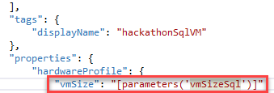

11. For storage, the SQL Server virtual machine will use managed disks to simplify manageability. This requires the API version of the SQL VM resource to be updated. In the Resource Explorer view, click hackathonSqlVM and in the code window update the API version value to match the following: 

    ```
    "apiVersion": "2017-03-30",
    ```

12. Modify OS Disk for managed disks by removing the name and vhd property inside the osDisk section. The osDisk section should look like the following:

    ```
    "osDisk": {
        "caching": "ReadWrite",
        "createOption": "FromImage"
    }
    ```

13. To deploy two 1TB data disks, add the following section to the
    properties, storage profile section of the **hackathonSqlVM** (right
    after osDisk)

    > **Tip:** Do not forget to add a comma at the end of the osDisk section.
    ```
    "dataDisks": [
        {
            "diskSizeGB": 1023,
            "lun": 0,
            "createOption": "Empty"
        },
        {
            "diskSizeGB": 1023,
            "lun": 1,
            "createOption": "Empty"
        }
    ]
    ```

    Your code change should look like this: 

    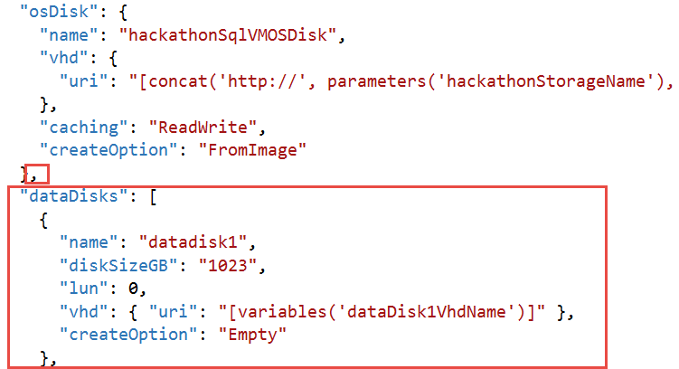

14. Next you will add the PowerShell DSC Extension named
    **hackathonDSCSQL** to the **azuredeploy.json** file for the SQL VM.
    This will register the VM with Azure Automation DSC Extension.**\**

    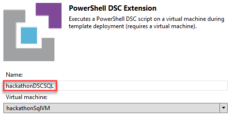

15. Create a new parameter that will be different for the SQL VM. In the
    **parameters** section, add the following code immediately after the
    existing **nodeConfigurationName** parameter.
    ```
       "sqlnodeConfigurationName": {
          "type": "string",
          "metadata": {
            "description": "Name of configuration to SQL"
          }
        },
    ```

    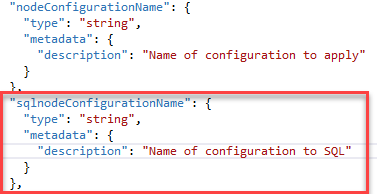

16. Save your changes to the **azuredeploy.json** template file

17. Navigate to the hackathonDscSQL resource

    

18. Change the Type Handler from **2.9 to 2.19**, and make sure that
    **autoUpgradeMinorVersion** is false

    

    > Note: This is due to a bug in PowerShell DSC at the time of this
    writing. It may be resolved by now.

19. Find the settings code within the PowerShell DSC section you just
    added, and replace it with this code:

    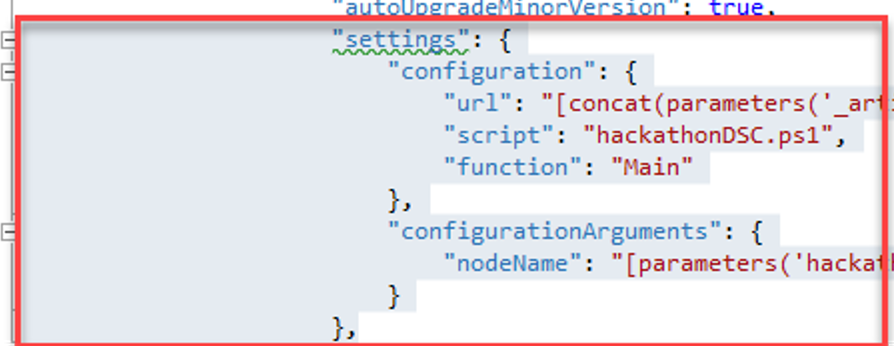
    ```
             "settings": {
              "modulesUrl": "https://cloudworkshop.blob.core.windows.net/arm-hackathon/RegistrationMetaConfigV2.zip",
              "configurationFunction": "RegistrationMetaConfigV2.ps1\\RegistrationMetaConfigV2",
              "Properties": [
               {
                "Name": "RegistrationKey",
                "Value": {
                 "UserName": "PLACEHOLDER_DONOTUSE",
                 "Password": "PrivateSettingsRef:registrationKeyPrivate"
                },
                "TypeName": "System.Management.Automation.PSCredential"
               },
               {
                "Name": "RegistrationUrl",
                "Value": "[parameters('registrationUrl')]",
                "TypeName": "System.String"
               },
               {
                "Name": "NodeConfigurationName",
                "Value": "[parameters('sqlnodeConfigurationName')]",
                "TypeName": "System.String"
               },
               {
                "Name": "ConfigurationMode",
                "Value": "[parameters('configurationMode')]",
                "TypeName": "System.String"
               },
               {
                "Name": "ConfigurationModeFrequencyMins",
                "Value": "[parameters('configurationModeFrequencyMins')]",
                "TypeName": "System.Int32"
               },
               {
                "Name": "RefreshFrequencyMins",
                "Value": "[parameters('refreshFrequencyMins')]",
                "TypeName": "System.Int32"
               },
               {
                "Name": "RebootNodeIfNeeded",
                "Value": "[parameters('rebootNodeIfNeeded')]",
                "TypeName": "System.Boolean"
               },
               {
                "Name": "ActionAfterReboot",
                "Value": "[parameters('actionAfterReboot')]",
                "TypeName": "System.String"
               },
               {
                "Name": "AllowModuleOverwrite",
                "Value": "[parameters('allowModuleOverwrite')]",
                "TypeName": "System.Boolean"
               },
               {
                "Name": "Timestamp",
                "Value": "[parameters('timestamp')]",
                "TypeName": "System.String"
               }
              ]
           },
    ```

20. Next, in the **protectedSettings** section, delete the
    "**configurationUrlSasToken**" line; replacing it with this code:
    ```
    "Items": {
        "registrationKeyPrivate": "[parameters('registrationKey')]"
     }
    ```

    Before:

    

    After:

    

21.  In the paramters section of the JSON outline, delete _artifactsLocation and _artifactsLocationSasToken:

    

     

22. Save your changes to the **azuredeploy.json** template file

### Task 4: Deploy your updated template to Azure

1.  Before deploying your updated template, you should take note of your
    Automation key and registration URL. In the Azure portal, click
    **Resource groups \> Automation\_RG \> Automation-Acct**. Then, in
    the Account Settings area, click the **Keys** icon.

    

2.  The information you will need to deploy your template is on the **Manage Keys** blade to the right. When doing the deployment from within Visual Studio, a Key needs to be provided. The **Primary Access Key** can be copied to the clipboard by clicking the button next to the Key on this blade.

    

3.  Using this same process, the **URL** can also be copied to use with
    Visual Studio

    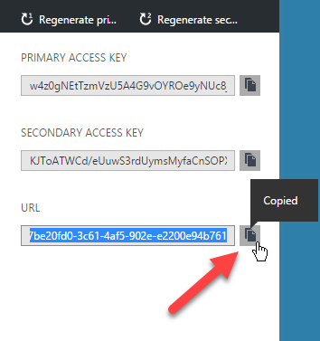

4.  You will also need the name of your Node Configurations you uploaded
    using the portal during Exercise 1. To find these, click the State configuration (DSC) tile on the Azure Automation Blade. Select the Configurations tab, click the name of each configuration to find the Node Name.

    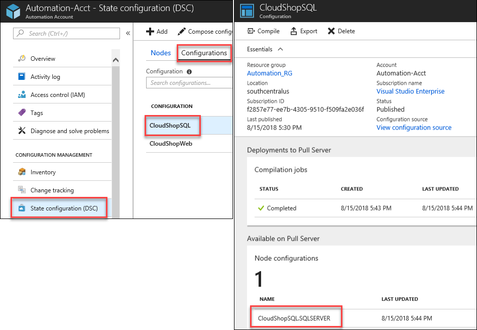

5.  Within Visual Studio, create a new deployment (*specify the same
    Resource group as before ARMHackathon)*
    
    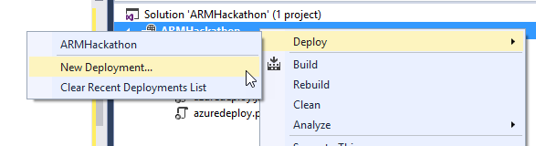

6.  On the **Deploy to Resource Group** dialog box, click **Edit Parameters**, and populate the empty values:

    

    -   hackathonVMName: **armweb**

    -   hackathonVMAdminUserName: **demouser**

    -   hackathonVMAdminPassword: **demo\@pass123**

    -   hackathonPublicIPDnsName: **Choose a unique looking DNS name (must
        be lowercase)**

    -   registrationKey: **Automation account key**

    -   registrationUrl: **Automation registration URL**

    -   nodeConfigurationName: **CloudShopWeb.WebServer**

    -   sqlnodeConfigurationName: **CloudShopSQL.SQLSERVER**

    -   rebootNodeIfNeeded: **True**

    -   allowModuleOverwrite: **True**

    -   configurationMode: **ApplyAndMonitor**

    -   configurationModeFrequencyMins: **15**

    -   refreshFrequencyMins: **30**

    -   actionAfterReboot: ContinueConfiguration

    -   timestamp: **\<enter current value in format like screenshot below\>**

    -   \_artifactsLocation: **\<Auto-generated\>**

    -   \_artifactsLocationSasToken: **\<Auto-generated\>**

    -   hackathonSQLVMName: **armsql**

    -   hackathonVMSQLAdminUserName: **demouser**

    -   hackathonVMSQLAdminPassword: **demo\@pass123**

    -   hackathonVMSQLSKU: **Web**

    -   vmsizeSQL: **Standard\_DS3\_v2**

    -   **Check: Save passwords as plain text in the parameters file**

    

    > Note: The deployment may take 20 to 30 minutes to complete.

    **Extension Troubleshooting Tip:** If you make a mistake with either of the
    Azure DSC extensions and need to redeploy, open the virtual machine in
    the portal. Under all settings, click extensions, and remove the failed
    extension before deploying. Then, in your Automation Account, under the
    DSC Nodes, unregister the node.

    > Note: The DSC configuration may take time to apply following the
    successful template deployment. Monitor this in the DSC Nodes section in
    the Automation Account properties. Wait to proceed until both nodes show
    as compliant.

7.  Launch the **Azure Management Portal** <http://portal.azure.com>,and navigate to the resource group you deployed to. Click the **virtual machine** for the web server. Then, click the **Public IP**.

    

8.  Copy the **IP address**, and navigate to it in the browser

    

## Exercise 4: Lock down the environment 

Duration: 15 minutes

In this exercise, you will deploy a network security group to restrict
the network attack surface for the deployment.

### Task 1: Restrict traffic to the web server

1.  Add the following at the beginning of the JSON template as the first
    item under the **resources** node. This will deploy the network
    security group resource and add a rule. Therefore, the only port
    open on the Public IP is port 80.

    

    
    ```
    {
     "apiVersion": "2016-03-30",
     "type": "Microsoft.Network/networkSecurityGroups",
     "name": "hackathonNetworkSecurityGroup",
     "location": "[resourceGroup().location]",
     "properties": {
      "securityRules": [
       {
        "name": "webrule",
        "properties": {
         "description": "This rule allows traffic in on port 80",
         "protocol": "Tcp",
         "sourcePortRange": "*",
         "destinationPortRange": "80",
         "sourceAddressPrefix": "INTERNET",
         "destinationAddressPrefix": "10.0.0.0/24",
         "access": "Allow",
         "priority": 100,
         "direction": "Inbound"
        }
       }
      ]
     }
    },
    ```

2.  Click the **hackathonVNet** resource to go to its configuration

    

3.  Associate the network security group with the
    **hackathonVnetSubnet1Name** subnet by adding a comma at the end of
    the **addressPrefix** block and pasting in the
    **networkSecurityGroup** reference

    ```
    "networkSecurityGroup": {
       "id": "[resourceId('Microsoft.Network/networkSecurityGroups', 'hackathonNetworkSecurityGroup')]"
     }
    ```

    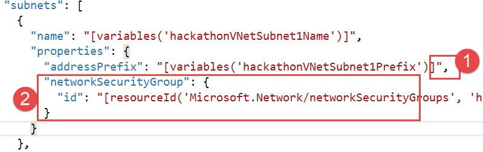

4.  Update the virtual network to have a dependency on the network security group

5.  Click the **hackathonVNet** resource to view the configuration

    

6.  Change the **dependsOn** configuration to refer to the network security group

    ```
        "dependsOn": [
        "[resourceId('Microsoft.Network/networkSecurityGroups', 'hackathonNetworkSecurityGroup')]"
        ],
    ```

7.  Right-click the Visual Studio project, and select **Deploy** from
    the context menu followed by **New Deployment**. Click **Deploy** to
    update the existing deployment with the network security group.

8.  In the Portal, browse to the ARMHackathon Resource Group and locate
    the newly added Network Security Group

    

9.  To validate the network security group is working:

    -   Browse to the Public IP or DNS name of the web server. The site
        should load because traffic is allowed on port 80.

    -   Connect to the **armweb** virtual machine by clicking
        **Connect** in the preview portal. This should fail because port
        3389 is not allowed in.

    

### Task 2: Update the network security group to allow Windows Remote Desktop

1.  Add a new rule to the network security group to allow in traffic on
    port 3389 Remote Desktop Protocol (RDP) by adding a comma at the end
    of the web rule and add the following code:
    ```
    {
     "name": "rdprule",
     "properties": {
      "description": "This rule allows traffic on port 3389 from the web",
      "protocol": "Tcp",
      "sourcePortRange": "*",
      "destinationPortRange": "3389",
      "sourceAddressPrefix": "INTERNET",
      "destinationAddressPrefix": "10.0.0.0/24",
      "access": "Allow",
      "priority": 200,
      "direction": "Inbound"
     }
    }
    ```

    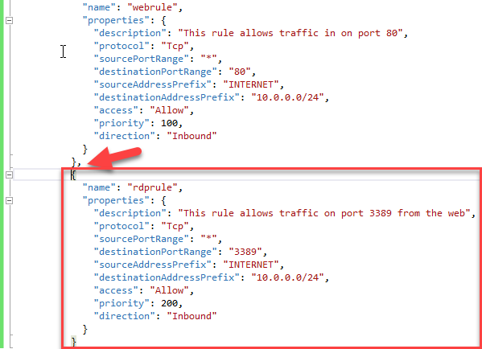

2.  Perform another Deployment using Visual Studio to set the rule and
    test RDP connectivity again

3.  Open the Azure Preview Portal, and navigate to the resource group
    containing your deployment

4.  Click the **hackathonNetworkSecurityGroup** in the resources
    summary

5.  Examine the created rules

    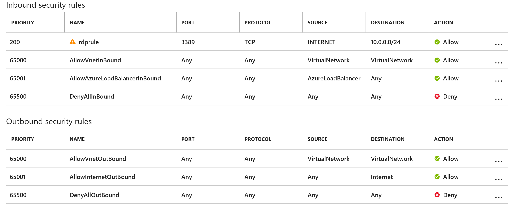

## Exercise 5: Scale out the deployment

Duration: 60 minutes

In this exercise, you will configure the template to scale out the web
front-end using a scalable number of virtual machines and storage
accounts. For this, you will use the load balancer and the scale sets
feature.

### Task 1: Parameterize and scale out the environment 

1.  Add the following variables to the end of the **variables** section
    of the **azuredeploy.json** file:

**Tip:** Do not forget to put a comma after the previous variables.


```
    "vmSSName": "webset",
    "publicIPAddressID": "[resourceId('Microsoft.Network/publicIPAddresses',variables('hackathonPublicIPName'))]",
    "lbName": "loadBalancer1",
    "lbID": "[resourceId('Microsoft.Network/loadBalancers',variables('lbName'))]",
    "lbFEName": "loadBalancerFrontEnd",
    "lbWebProbeName": "loadBalancerWebProbe",
    "lbBEAddressPool": "loadBalancerBEAddressPool",
    "lbFEIPConfigID": "[concat(variables('lbID'),'/frontendIPConfigurations/',variables('lbFEName'))]",
    "lbBEAddressPoolID": "[concat(variables('lbID'),'/backendAddressPools/',variables('lbBEAddressPool'))]",
    "lbWebProbeID": "[concat(variables('lbID'),'/probes/',variables('lbWebProbeName'))]"
```

2.  Add the following parameters to the end of the **parameters**
    section of the **azuredeploy.json** file (do not forget to add the
    comma after the last parameter)
    ```
      "instanceCount": {
       "type": "string",
       "metadata": {
        "description": "Number of VM instances"
       }
      }
    ```

    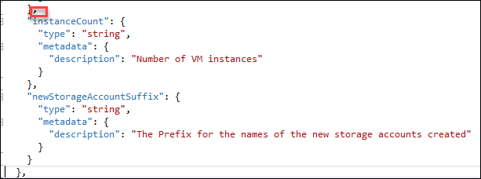


3.  Add a new storage account resource using the copy function by pasting the following code as the first resource in the list

    
    ```
    {
     "type": "Microsoft.Storage/storageAccounts",
     "name": "[concat(variables('StorageAccountPrefix')[copyIndex()],parameters('newStorageAccountSuffix'))]",
     "apiVersion": "2015-06-15",
     "copy": {
      "name": "storageLoop",
      "count": 5
     },
     "location": "[resourceGroup().location]",
     "properties": {
      "accountType": "[parameters('hackStorageType')]"
     }
    },
    ```

    > Note: This code will create five storage accounts. The virtual machine
    scale set will distribute the virtual machine disks across the storage
    accounts to ensure the VMs do not run out of IO capacity.

4.  Add a load balancer resource by pasting the following code as the first resource in the list.


    

    > Note: This code creates a load balancer resource that is listening on port 80.
    ```
        {
        "apiVersion": "2016-03-30",
        "name": "[variables('lbName')]",
        "type": "Microsoft.Network/loadBalancers",
        "location": "[resourceGroup().location]",
        "dependsOn": [
        "[concat('Microsoft.Network/publicIPAddresses/',variables('hackathonPublicIPName'))]"
        ],
        "properties": {
        "frontendIPConfigurations": [
        {
            "name": "[variables('lbFEName')]",
            "properties": {
            "publicIPAddress": {
            "id": "[variables('publicIPAddressID')]"
            }
            }
        }
        ],
        "backendAddressPools": [
        {
            "name": "[variables('lbBEAddressPool')]"
        }
        ],
        "loadBalancingRules": [
        {
            "name": "weblb",
            "properties": {
            "frontendIPConfiguration": {
            "id": "[variables('lbFEIPConfigID')]"
            },
            "backendAddressPool": {
            "id": "[variables('lbBEAddressPoolID')]"
            },
            "probe": {
            "id": "[variables('lbWebProbeID')]"
            },
            "protocol": "Tcp",
            "frontendPort": 80,
            "backendPort": 80,
            "enableFloatingIP": false
            }
        }
        ],
        "probes": [
        {
            "name": "[variables('lbWebProbeName')]",
            "properties": {
            "protocol": "Http",
            "port": 80,
            "intervalInSeconds": 15,
            "numberOfProbes": 5,
            "requestPath": "/"
            }
        }
        ]
        }
        },
    ```

5.  Add the virtual machine scale set to the **resources** section using
    the following configuration:
    ```
    {
       "type": "Microsoft.Compute/virtualMachineScaleSets",
       "apiVersion": "2017-03-30",
       "name": "[variables('vmSSName')]",
       "location": "[resourceGroup().location]",
       "tags": {
        "vmsstag1": "Myriad"
       },
       "dependsOn": [
        "[concat('Microsoft.Network/loadBalancers/',variables('lbName'))]",
        "[concat('Microsoft.Network/virtualNetworks/','hackathonVnet')]"
       ],
       "sku": {
        "name": "Standard_DS1_V2",
        "tier": "Standard",
        "capacity": "[parameters('instanceCount')]"
       },
       "properties": {
        "upgradePolicy": {
         "mode": "Manual"
        },
        "virtualMachineProfile": {
         "storageProfile": {
          "osDisk": {
           "caching": "ReadOnly",
           "createOption": "FromImage"
          },
          "imageReference": {
           "publisher": "[variables('hackathonVMImagePublisher')]",
           "offer": "[variables('hackathonVMImageOffer')]",
           "sku": "[parameters('hackathonVMWindowsOSVersion')]",
           "version": "latest"
          }
         },
         "osProfile": {
          "computerNamePrefix": "[variables('vmSSName')]",
          "adminUsername": "[parameters('hackathonVMAdminUserName')]",
          "adminPassword": "[parameters('hackathonVMAdminPassword')]"
         },
         "networkProfile": {
          "networkInterfaceConfigurations": [
           {
            "name": "nic1",
            "properties": {
             "primary": true,
             "ipConfigurations": [
              {
               "name": "ip1",
               "properties": {
                "subnet": {
                 "id": "[variables('hackathonVMSubnetRef')]"
                },
                "loadBalancerBackendAddressPools": [
                 { "id": "[variables('lbBEAddressPoolID')]" }
                ]
               }
              }
             ]
            }
           }
          ]
         },
         "extensionProfile": {
          "extensions": [
           {
            "name": "hackathonDSC",
            "properties": {
             "publisher": "Microsoft.Powershell",
             "type": "DSC",
             "typeHandlerVersion": "2.19",
             "autoUpgradeMinorVersion": true,
             "protectedSettings": {
              "Items": {
               "registrationKeyPrivate": "[parameters('registrationKey')]"
              }
             },
             "settings": {
              "modulesUrl": "https://cloudworkshop.blob.core.windows.net/arm-hackathon/RegistrationMetaConfigV2.zip",
              "configurationFunction": "RegistrationMetaConfigV2.ps1\\RegistrationMetaConfigV2",
              "Properties": [
               {
                "Name": "RegistrationKey",
                "Value": {
                 "UserName": "PLACEHOLDER_DONOTUSE",
                 "Password": "PrivateSettingsRef:registrationKeyPrivate"
                },
                "TypeName": "System.Management.Automation.PSCredential"
               },
               {
                "Name": "RegistrationUrl",
                "Value": "[parameters('registrationUrl')]",
                "TypeName": "System.String"
               },
               {
                "Name": "NodeConfigurationName",
                "Value": "CloudShopWeb.WebServer",
                "TypeName": "System.String"
               },
               {
                "Name": "ConfigurationMode",
                "Value": "[parameters('configurationMode')]",
                "TypeName": "System.String"
               },
               {
                "Name": "ConfigurationModeFrequencyMins",
                "Value": "[parameters('configurationModeFrequencyMins')]",
                "TypeName": "System.Int32"
               },
               {
                "Name": "RefreshFrequencyMins",
                "Value": "[parameters('refreshFrequencyMins')]",
                "TypeName": "System.Int32"
               },
               {
                "Name": "RebootNodeIfNeeded",
                "Value": "[parameters('rebootNodeIfNeeded')]",
                "TypeName": "System.Boolean"
               },
               {
                "Name": "ActionAfterReboot",
                "Value": "[parameters('actionAfterReboot')]",
                "TypeName": "System.String"
               },
               {
                "Name": "AllowModuleOverwrite",
                "Value": "[parameters('allowModuleOverwrite')]",
                "TypeName": "System.Boolean"
               },
               {
                "Name": "Timestamp",
                "Value": "[parameters('timestamp')]",
                "TypeName": "System.String"
               }
              ]
             }
            }
           }
          ]
         }
        }
       }
      },
    ```
    
    > Note: This code creates a virtual machine scale sets resource that will
    create as many instances of the virtual machine as specified in the
    instanceCount parameter. The DSC extension will execute on each VM when
    it is created to configure the cloud shop web application. The scale set
    will distribute the VM disks across the previously created storage
    accounts.

6.  Delete the existing **hackathonVM** and the **hackathonVMNic**
    resources by right-clicking each resource and clicking **Delete**

    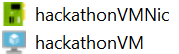

This VM and NIC will be replaced by the VMs in the scale set.

7.  Delete the existing deployment (to save on core quota) by opening
    the Azure portal (portal.azure.com) in your browser

8.  Click **Resource groups**

    

9.  Click the **ARMHackathon** resource group (or whatever you named
    your deployment)

        

10. Click **Delete**, and then, confirm by typing in the name of the resource group

    

    > Note: Wait until the Resource Group has been deleted prior to moving onto the next step.

11. Create a **new deployment**, and choose a new **resource group**. Name the new resource group **ARMHackathonScaleSet**.

    

12. Choose any of the template parameters files, and click **Edit Parameters**

    

13. Provide a unique value for the **hackathonPublicIPDnsName**. Enter a value of **2** for the **instanceCount**. Click **Save** and **Deploy**.

    

    > Note: The deployment may take 30 to 45 minutes to complete. If Visual
    Studio fails monitoring the solution with an error about the SAS Token
    expiring, you can open the resource group in the Portal, and you can
    monitor the deployment by clicking the link under the Last Deployment
    lab on the essentials pane.

14. Within the **Azure Management Portal**, open the **resource group**, and click the **hackathonPublicIP** resource

    

15. Copy the **DNS name**, and navigate to it in a browser to validate the load balancer and the scale set are working. Click **Refresh** several times, and the page should flip from WEBSET-0 to WEBSET-1.

    

## After the hands-on lab 

Duration: 10 minutes
    > Note: Do not complete these steps if you plan on doing the supplemental exercises.

### Task 1: Delete the resource groups created

1.  Within the Azure portal, click Resource Groups on the left navigation

2.  Delete each of the resource groups created in this lab by clicking
    them followed by clicking the Delete Resource Group button. You will
    need to confirm the name of the resource group to delete.

You should follow all steps provided *after* attending the hands-on lab.

