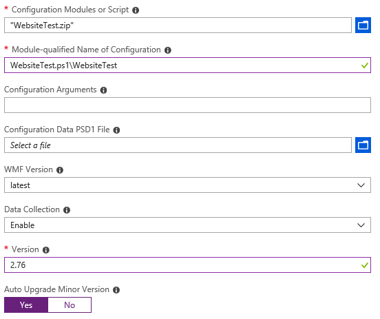
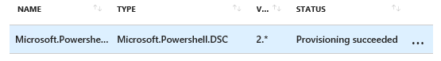

<div class="MCWHeader1">
Azure Resource Manager
</div>

<div class="MCWHeader2">
Supplement to the Hands-on Lab: Introduction to DSC
</div>

<div class="MCWHeader3">
July 2018
</div>


Information in this document, including URL and other Internet Web site references, is subject to change without notice. Unless otherwise noted, the example companies, organizations, products, domain names, e-mail addresses, logos, people, places, and events depicted herein are fictitious, and no association with any real company, organization, product, domain name, e-mail address, logo, person, place or event is intended or should be inferred. Complying with all applicable copyright laws is the responsibility of the user. Without limiting the rights under copyright, no part of this document may be reproduced, stored in or introduced into a retrieval system, or transmitted in any form or by any means (electronic, mechanical, photocopying, recording, or otherwise), or for any purpose, without the express written permission of Microsoft Corporation.

Microsoft may have patents, patent applications, trademarks, copyrights, or other intellectual property rights covering subject matter in this document. Except as expressly provided in any written license agreement from Microsoft, the furnishing of this document does not give you any license to these patents, trademarks, copyrights, or other intellectual property.

The names of manufacturers, products, or URLs are provided for informational purposes only and Microsoft makes no representations and warranties, either expressed, implied, or statutory, regarding these manufacturers or the use of the products with any Microsoft technologies. The inclusion of a manufacturer or product does not imply endorsement of Microsoft of the manufacturer or product. Links may be provided to third party sites. Such sites are not under the control of Microsoft and Microsoft is not responsible for the contents of any linked site or any link contained in a linked site, or any changes or updates to such sites. Microsoft is not responsible for webcasting or any other form of transmission received from any linked site. Microsoft is providing these links to you only as a convenience, and the inclusion of any link does not imply endorsement of Microsoft of the site or the products contained therein.

© 2018 Microsoft Corporation. All rights reserved.

Microsoft and the trademarks listed at <https://www.microsoft.com/en-us/legal/intellectualproperty/Trademarks/Usage/General.aspx> are trademarks of the Microsoft group of companies. All other trademarks are property of their respective owners.

**Contents**

<!-- TOC -->

- [Azure Resource Manager introduction to DSC](#azure-resource-manager-introduction-to-dsc)
    - [Abstract and learning objectives](#abstract-and-learning-objectives)
    - [Exercise 1: Create Powershell Desired State Configuration](#exercise-1-create-powershell-desired-state-configuration)
        - [Task 1: Write an HTML file](#task-1-write-an-html-file)
        - [Task 2: Write the configuration](#task-2-write-the-configuration)
    - [Exercise 2: Deploy DSC using Azure Virtual Machine extensions](#exercise-2-deploy-dsc-using-azure-virtual-machine-extensions)


<!-- /TOC -->

# Azure Resource Manager introduction to DSC

## Abstract and learning objectives

In this hands-on lab, you will learn how to author a Desired State Configuration using Powershell DSC.  This lab will also cover applying DSC to a virtual machine using virtual machine extensions, how to verify DSC has been applied successfully, and how to troubleshoot DSC.

## Exercise 1: Create Powershell Desired State Configuration

Duration: 10 minutes

In this exercise, you will create a powershell Desired State Configuration (DSC) and apply the configuration manually.

### Task 1: Write an HTML file

1. In your root folder, create a folder named `test`.

2. In a text editor, type the following text:

```html
<head></head>
<body>
<p>Hello World!</p>
</body>
```

3. Save this as `index.htm` in the `test` folder you created earlier.

### Task 2: Write the configuration

1. In the VM created in the 'Before hands on lab...' open PowerShell ISE and type the following:

```powershell
Configuration WebsiteTest {

    # Import the module that contains the resources we're using.
    Import-DscResource -ModuleName PsDesiredStateConfiguration

    # The Node statement specifies which targets this configuration will be applied to.
    Node 'localhost' {

        # The first resource block ensures that the Web-Server (IIS) feature is enabled.
        WindowsFeature WebServer {
            Ensure = "Present"
            Name   = "Web-Server"
        }

        # The second resource block ensures that the website content copied to the website root folder.
        File WebsiteContent {
            Ensure = 'Present'
            SourcePath = 'c:\test\index.htm'
            DestinationPath = 'c:\inetpub\wwwroot'
        }
    }
}
```

2. Save the file as `WebsiteTest.ps1`.

### Task 3: Compile the configuration

1. To compile the configuration, run WebsiteTest.ps1.  This places the function in a global scope
```powershell
PS C:\ConfigurationTest>. .\WebsiteTest.ps1
```
2. Next, run the function by entering it's name.  The output will be a MOF file
```powershell
PS C:\ConfigurationTest>WebsiteTest
Directory: C:\ConfigurationTest\WebsiteTest
Mode                LastWriteTime         Length Name                                                              
----                -------------         ------ ----                                                              
-a----        7/24/2018  11:58 PM           2756 localhost.mof  
```

### Task 4: Apply the configuration and verify status

1. Apply the configuraiton by running the following command:
```powershell
PS C:\ConfigurationTest> Start-DscConfiguration .\WebsiteTest
```
2. It will take a few minutes for the configuration to apply.  Get the status of the configuration by running the following command.
```powershell
Get-DscConfigurationStatus
```
3. Once the status shows 'Success', browse to http://locahost 

4. Alternatively, DSC status can be retrieved by examining the Windows Event Viewer. DSC events are in: Applications and Services Logs/Microsoft/Windows/Desired State Configuration.

### Task 5: Cleanup
The local DSC configuration will be removed so that it can be applied through Azure VM extensions in Exercise 2.
1. In PowerShell, run the following command:
```powershell
Remove-DscConfigurationDocument -Stage Current
```
2. The previous step removed the .mof document.  The individual server configuration must still be reverted.  To do this, run the following command:
```powershell
Uninstall-WindowsFeature Web-Server
```
3. Restart the server

## Exercise 2: Deploy DSC using Azure Virtual Machine extensions

Duration: 10 minutes

In this exercise, you will apply the DSC from Exercise 1 using the Azure VM extension for DSC

### Task 1: Package the DSC configuration script
The VM extension for PowerShell DSC requires that the configuration script be provided in a .zip file.
1. Open Powershell, navigate to the C:\ConfigurationTest folder and run the following command:

```powershell
PS C:\ConfigurationTest>compress-archive WebsiteTest.ps1 -DestinationPath WebsiteTest.zip
```

### Task 2: Add and configure the VM extenion

1. Log into the portal.azure.com

2. Under Resource Groups, click on **OPSLABRG**

3. Within the **OPSLABRG** Resource Group, click on the LABVM

4. In the Virtual Machine blade, under settings, click on Extensions
 

 5. In the Extensions blade, click on + Add
 

 6. In the New Resource blade, click on PowerShell Desired State Configuration
 

 7. In the blade that opens, click Create 

 8. In the Install extension blade that opens enter the following information and click OK:

    -   Configuration Modules or Script: Select the ZIP file created in Task 1: **WebsiteTest.zip**

    -   Module-qualified Name of Configuration: **WebsiteTest.ps1\WebsiteTest**

    -   Version: **2.76**

    -   Auto Upgrade Minor Version: **Yes**

    

9. It will take 2-3 minutes for the deployment to complete successfully and for the extension to show as **Provisioning succeeded**


10. Once provisioning is complete, verify by running the PowerShell command below and by browsing to http://localhost 
```powershell
PS C:\ConfigurationTest> Get-DscConfigurationStatus
```

