

<div class="MCWHeader1">
Azure Resource Manager
</div>

<div class="MCWHeader2">
Hands-on lab step-by-step
</div>

<div class="MCWHeader3">
July 2018
</div>


Information in this document, including URL and other Internet Web site references, is subject to change without notice. Unless otherwise noted, the example companies, organizations, products, domain names, e-mail addresses, logos, people, places, and events depicted herein are fictitious, and no association with any real company, organization, product, domain name, e-mail address, logo, person, place or event is intended or should be inferred. Complying with all applicable copyright laws is the responsibility of the user. Without limiting the rights under copyright, no part of this document may be reproduced, stored in or introduced into a retrieval system, or transmitted in any form or by any means (electronic, mechanical, photocopying, recording, or otherwise), or for any purpose, without the express written permission of Microsoft Corporation.

Microsoft may have patents, patent applications, trademarks, copyrights, or other intellectual property rights covering subject matter in this document. Except as expressly provided in any written license agreement from Microsoft, the furnishing of this document does not give you any license to these patents, trademarks, copyrights, or other intellectual property.

The names of manufacturers, products, or URLs are provided for informational purposes only and Microsoft makes no representations and warranties, either expressed, implied, or statutory, regarding these manufacturers or the use of the products with any Microsoft technologies. The inclusion of a manufacturer or product does not imply endorsement of Microsoft of the manufacturer or product. Links may be provided to third party sites. Such sites are not under the control of Microsoft and Microsoft is not responsible for the contents of any linked site or any link contained in a linked site, or any changes or updates to such sites. Microsoft is not responsible for webcasting or any other form of transmission received from any linked site. Microsoft is providing these links to you only as a convenience, and the inclusion of any link does not imply endorsement of Microsoft of the site or the products contained therein.
© 2018 Microsoft Corporation. All rights reserved.

Microsoft and the trademarks listed at https://www.microsoft.com/en-us/legal/intellectualproperty/Trademarks/Usage/General.aspx are trademarks of the Microsoft group of companies. All other trademarks are property of their respective owners.

**Contents**

<!-- TOC -->

- [Azure Resource Manager hands-on lab step-by-step - Scale to 2nd Region with Application Gateway](#azure-resource-manager-hands-on-lab-step-by-step - scale-to-2nd-region-with-application-gateway)
    - [Abstract and learning objectives](#abstract-and-learning-objectives)
    - [Exercise 5: Scale out the deployment](#exercise-5-scale-out-the-deployment)
        - [Task 1: Parameterize and scale out the environment](#task-1-parameterize-and-scale-out-the-environment)
    - [After the hands-on lab](#after-the-hands-on-lab)
        - [Task 1: Delete the resource groups created](#task-1-delete-the-resource-groups-created)

<!-- /TOC -->

# Azure Resource Manager hands-on lab step-by-step - Scale to 2nd Region with Application Gateway

## Abstract and learning objectives 

In this hands-on lab, you will deploy a 2nd instance of the infrastructure from the 1st HoL to another region.  The 2nd instance will be configured to use an Application Gateway in place of a Load Balancer.  Finally, Traffic Manager will be used to route traffice between both instances.

-   How to deploy and configure an Application Gateway with VM Scale Sets

-   How to deploy and configure Traffic Manager


## Exercise 1: Create a 2nd instance of architecture in another region

Duration: 60 minutes

In this exercise, you will configure the template to scale out to a 2nd region by deploying a 2nd instance of the architecture.  The 2nd instance will use an Application Gateway.

 > Note: Consider making a copy of the Visual Studio solution

### Task 1: Add the Application Gateway

1. Before adding the Application Gateway, delete the Load Balancer:
    In the JSON Outline window, under resources, click on the Load Balancer and delte it.
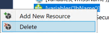

    In the same window, under variables, delete the lbxxx variables
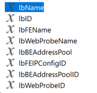

2. Add the following variables to the end of the **variables** section of the **azuredeploy.json** file:
    > Note: Do not forget to add the comma
    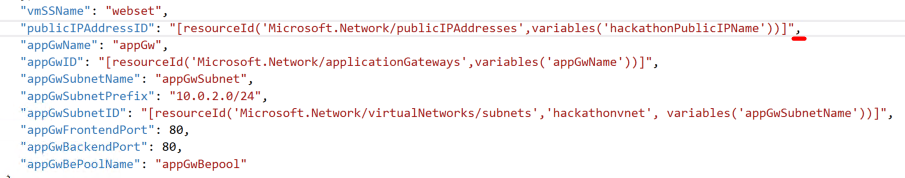

```
    "appGwName": "appGw",
    "appGwID": "[resourceId('Microsoft.Network/applicationGateways',variables('appGwName'))]",
    "appGwSubnetName": "appGwSubnet",
    "appGwSubnetPrefix": "10.0.2.0/24",
    "appGwSubnetID": "[resourceId('Microsoft.Network/virtualNetworks/subnets','hackathonvnet', variables('appGwSubnetName'))]",
    "appGwFrontendPort": 80,
    "appGwBackendPort": 80,
    "appGwBePoolName": "appGwBepool",
    "appGwBePoolID": "[concat(variables('appGwID'), '/backendAddressPools/', variables('appGwBePoolName'))]"
```

3. Add the following JSON at the beginning of the JSON template as the first item under the **resources** node.  


 > Note: This code creates an Application Gateway

 ```
     {
      "type": "Microsoft.Network/applicationGateways",
      "name": "[variables('appGwName')]",
      "location": "[resourceGroup().location]",
      "apiVersion": "2016-03-30",
      "dependsOn": [
        "[concat('Microsoft.Network/virtualNetworks/','hackathonVnet')]",
        "[concat('Microsoft.Network/publicIPAddresses/', variables('hackathonPublicIPName'))]"
      ],
      "properties": {
        "sku": {
          "name": "Standard_Large",
          "tier": "Standard",
          "capacity": "10"
        },
        "gatewayIPConfigurations": [
          {
            "name": "appGwIpConfig",
            "properties": {
              "subnet": {
                "id": "[variables('appGwSubnetID')]"
              }
            }
          }
        ],
        "frontendIPConfigurations": [
          {
            "name": "appGwFrontendIP",
            "properties": {
              "PublicIPAddress": {
                "id": "[variables('PublicIPAddressID')]"
              }
            }
          }
        ],
        "frontendPorts": [
          {
            "name": "appGwFrontendPort",
            "properties": {
              "Port": "[variables('appGwFrontendPort')]"
            }
          }
        ],
        "backendAddressPools": [
          {
            "name": "[variables('appGwBePoolName')]"
          }
        ],
        "backendHttpSettingsCollection": [
          {
            "name": "appGwBackendHttpSettings",
            "properties": {
              "Port": "[variables('appGwBackendPort')]",
              "Protocol": "Http",
              "CookieBasedAffinity": "Disabled"
            }
          }
        ],
        "httpListeners": [
          {
            "name": "appGwHttpListener",
            "properties": {
              "FrontendIPConfiguration": {
                "Id": "[concat(variables('appGwID'), '/frontendIPConfigurations/appGwFrontendIP')]"
              },
              "FrontendPort": {
                "Id": "[concat(variables('appGwID'), '/frontendPorts/appGwFrontendPort')]"
              },
              "Protocol": "Http",
              "SslCertificate": null
            }
          }
        ],
        "requestRoutingRules": [
          {
            "Name": "rule1",
            "properties": {
              "RuleType": "Basic",
              "httpListener": {
                "id": "[concat(variables('appGwID'), '/httpListeners/appGwHttpListener')]"
              },
              "backendAddressPool": {
                "id": "[concat(variables('appGwID'), '/backendAddressPools/', variables('appGwBePoolName'))]"
              },
              "backendHttpSettings": {
                "id": "[concat(variables('appGwID'), '/backendHttpSettingsCollection/appGwBackendHttpSettings')]"
              }
            }
          }
        ]
      }
    },
```

### Task 2: Update the VNet to provide a subnet for the application gateway
1. In the JSON outline window, click on hackathonVnet
    Add the below after the last subnet:
    > Note: Do not forget to add the comma
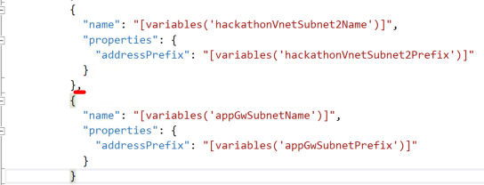

```
          {
            "name": "[variables('appGwSubnetName')]",
            "properties": {
              "addressPrefix": "[variables('appGwSubnetPrefix')]"
            }
          }
```

### Task 3: Update the VMSS resource to use the Application Gateway
1. In the JSON outline window, click on the VMSS object
    Update the \"dependsOn\" section from:
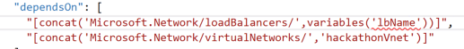

 To:

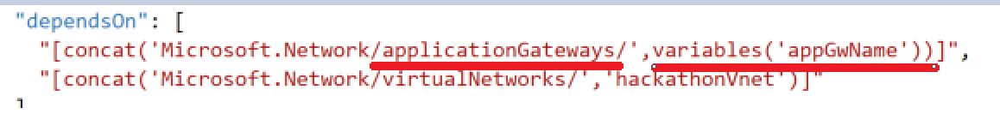


2. Scroll down to the networkProfile section.
    Replace \"loadBalancerBAckendAddressPools\" from


 To:


```
    "ApplicationGatewayBackendAddressPools": [
        {
        "id": "[variables('appGwBePoolID')]"
        }
    ]
```

### Task 4:

1. Create a **new deployment**, and choose a new **resource group**. Name the new resource group **ARMHackathonScaleSetRegion2**.

    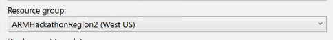

    > Note: Be sure to choose a different region for the location field

2. Choose any of the template parameters files, and click **Edit Parameters**

    

3. Provide a unique value for the **hackathonPublicIPDnsName**. Enter a value of **2** for the **instanceCount**. Click **Save** and **Deploy**.
    > Note: The **hackathonPublicIPDnsName** must be changed since it's already in use in the first deployment

    

    > Note: The deployment may take 30 to 45 minutes to complete. If Visual
    Studio fails monitoring the solution with an error about the SAS Token
    expiring, you can open the resource group in the Portal, and you can
    monitor the deployment by clicking the link under the Last Deployment
    lab on the essentials pane.

4. Within the **Azure Management Portal**, open the **resource group**, and click the **hackathonPublicIP** resource

    

5. Copy the **DNS name**, and navigate to it in a browser to validate the load balancer and the scale set are working. Click **Refresh** several times, and the page should flip from WEBSET-0 to WEBSET-1.

    


##Exercise 2: Create Traffic Manager

1. In the Azure portal, click on **Create New Resource** and search for **Traffic Manager**
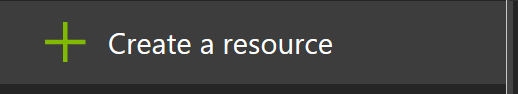
  Click on Traffic Manager Profile
  Click on Create
      

2. Create the Traffic Manager Profile with the following configuration:
  - Name: must be unique
  - Routing Method: Weighted
  - Resource Group: (Create New) TrafficManager
  - Resource Group Location: East US

 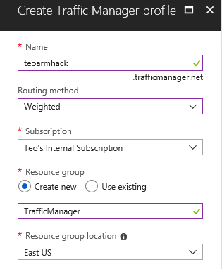

 3. Go to the Resource Group where Traffic Manager was created and click on the Traffic Manager resource

 4. In the Traffic Manager configuration, click on Endpoints

  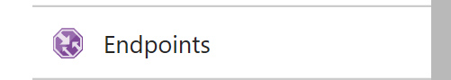

  5. Click on Add

 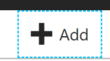

  6. Fill in the New Endpoint form with the appropriate information.  Do the same for the both endpoints / application instances.

   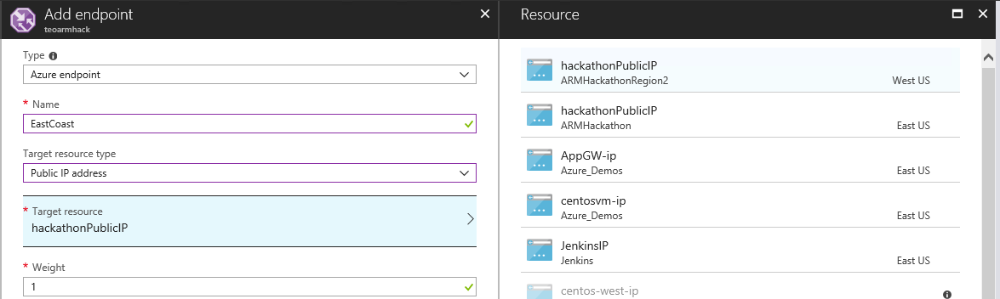

   7. Once the endpoints are added, click refresh until both endpoints show as Online

    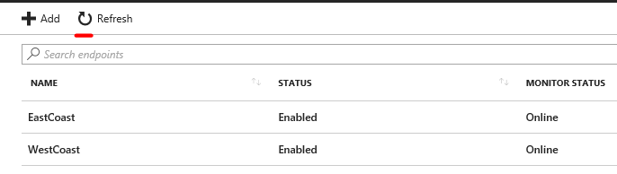

    8. Test that TM works by going to the Traffic Manager endpoint from 2 different workstations
    

