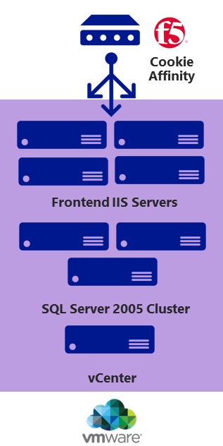

Lift and shift

Whiteboard design session trainer guide

March 2018

Information in this document, including URL and other Internet Web site references, is subject to change without notice. Unless otherwise noted, the example companies, organizations, products, domain names, e-mail addresses, logos, people, places, and events depicted herein are fictitious, and no association with any real company, organization, product, domain name, e-mail address, logo, person, place or event is intended or should be inferred. Complying with all applicable copyright laws is the responsibility of the user. Without limiting the rights under copyright, no part of this document may be reproduced, stored in or introduced into a retrieval system, or transmitted in any form or by any means (electronic, mechanical, photocopying, recording, or otherwise), or for any purpose, without the express written permission of Microsoft Corporation.

Microsoft may have patents, patent applications, trademarks, copyrights, or other intellectual property rights covering subject matter in this document. Except as expressly provided in any written license agreement from Microsoft, the furnishing of this document does not give you any license to these patents, trademarks, copyrights, or other intellectual property.

The names of manufacturers, products, or URLs are provided for informational purposes only and Microsoft makes no representations and warranties, either expressed, implied, or statutory, regarding these manufacturers or the use of the products with any Microsoft technologies. The inclusion of a manufacturer or product does not imply endorsement of Microsoft of the manufacturer or product. Links may be provided to third party sites. Such sites are not under the control of Microsoft and Microsoft is not responsible for the contents of any linked site or any link contained in a linked site, or any changes or updates to such sites. Microsoft is not responsible for webcasting or any other form of transmission received from any linked site. Microsoft is providing these links to you only as a convenience, and the inclusion of any link does not imply endorsement of Microsoft of the site or the products contained therein.
© 2018 Microsoft Corporation. All rights reserved.

Microsoft and the trademarks listed at https://www.microsoft.com/en-us/legal/intellectualproperty/Trademarks/Usage/General.aspx are trademarks of the Microsoft group of companies. All other trademarks are property of their respective owners.

**Contents**

<!-- TOC -->

- [Trainer information](#trainer-information)
    - [Role of the trainer](#role-of-the-trainer)
    - [Whiteboard design session flow](#whiteboard-design-session-flow)
    - [Before the whiteboard design session: How to prepare](#before-the-whiteboard-design-session-how-to-prepare)
    - [During the whiteboard design session: Tips for an effective whiteboard design session](#during-the-whiteboard-design-session-tips-for-an-effective-whiteboard-design-session)
- [Lift and shift whiteboard design session student guide](#lift-and-shift-whiteboard-design-session-student-guide)
    - [Abstract and learning objectives](#abstract-and-learning-objectives)
    - [Step 1: Review the customer case study](#step-1-review-the-customer-case-study)
        - [Customer situation](#customer-situation)
        - [Customer needs](#customer-needs)
        - [Customer objections](#customer-objections)
        - [Infographic for common scenarios](#infographic-for-common-scenarios)
    - [Step 2: Design a proof of concept solution](#step-2-design-a-proof-of-concept-solution)
    - [Step 3: Present the solution](#step-3-present-the-solution)
    - [Wrap-up](#wrap-up)
    - [Additional references](#additional-references)
- [Lift and shift whiteboard design session trainer guide](#lift-and-shift-whiteboard-design-session-trainer-guide)
    - [Step 1: Review the customer case study](#step-1-review-the-customer-case-study-1)
    - [Step 2: Design a proof of concept solution](#step-2-design-a-proof-of-concept-solution-1)
    - [Step 3: Present the solution](#step-3-present-the-solution-1)
    - [Wrap-up](#wrap-up-1)
    - [Preferred target audience](#preferred-target-audience)
    - [Preferred solution](#preferred-solution)
    - [Checklist of preferred objection handling](#checklist-of-preferred-objection-handling)
    - [Customer quote (to be read back to the attendees at the end)](#customer-quote-to-be-read-back-to-the-attendees-at-the-end)

<!-- /TOC -->

# Trainer information

Thank you for taking time to support the whiteboard design sessions as a trainer!

## Role of the trainer

An amazing trainer:

-   Creates a safe environment in which learning can take place.

-   Stimulates the participant's thinking.

-   Involves the participant in the learning process.

-   Manages the learning process (on time, on topic, and adjusting to
    benefit participants).

-   Ensures individual participant accountability.

-   Ties it all together for the participant.

-   Provides insight and experience to the learning process.

-   Effectively leads the whiteboard design session discussion.

-   Monitors quality and appropriateness of participant deliverables.

-   Effectively leads the feedback process.

## Whiteboard design session flow 

Each whiteboard design session uses the following flow:

**Step 1: Review the customer case study (15 minutes)**

Outcome: Analyze your customer's needs

-   Customer's background, situation, needs and technical requirements

-   Current customer infrastructure and architecture

-   Potential issues, objectives and blockers

**Step 2: Design a proof of concept solution (60 minutes)**

Outcome: Prepare to present a solution for your target customer audience

-   Determine your target customer audience

-   Determine customer's business needs to address your solution

-   Design and diagram your solution

-   Prepare to present your solution

**Step 3: Present the solution (30 minutes)**

Outcome: Present solution to your customer

-   Present solution

-   Respond to customer objections

-   Receive feedback

**Wrap-up (15 minutes)**

-   Review preferred solution

## Before the whiteboard design session: How to prepare

Before conducting your first whiteboard design session:

-   Read the Student guide (including the case study) and Trainer guide

-   Become familiar with all key points and activities.

-   Plan the point you want to stress, which questions you want to
    drive, transitions, and be ready to answer questions.

-   Prior to the whiteboard design session, discuss the case study to
    pick up more ideas.

-   Make notes for later.

## During the whiteboard design session: Tips for an effective whiteboard design session

**Refer to the Trainer guide** to stay on track and observe the timings.

**Do not expect to memorize every detail** of the whiteboard design
session.

When participants are doing activities, you can **look ahead to refresh
your memory**.

-   **Adjust activity and whiteboard design session pace** as needed to
    allow time for presenting, feedback, and sharing.

-   **Add examples, points, and stories** from your own experience.
    Think about stories you can share that help you make your points
    clearly and effectively.

-   **Consider creating a "parking lot"** to record issues or questions
    raised that are outside the scope of the whiteboard design session
    or can be answered later. Decide how you will address these issues,
    so you can acknowledge them without being derailed by them.

***Have fun**! Encourage participants to have fun and share!*

**Involve your participants.** Talk and share your knowledge but always
involve your participants, even while you are the one speaking.

**Ask questions** and get them to share to fully involve your group in
the learning process.

**Ask first**, whenever possible. Before launching into a topic, learn
your audience's opinions about it and experiences with it. Asking first
enables you to assess their level of knowledge and experience, and
leaves them more open to what you are presenting.

**Wait for responses**. If you ask a question such as, "What's your
experience with (fill in the blank)?" then wait. Do not be afraid of a
little silence. If you leap into the silence, your participants will
feel you are not serious about involving them and will become passive.
Give participants a chance to think, and if no one answers, patiently
ask again. You will usually get a response.

#  Lift and shift whiteboard design session student guide

## Abstract and learning objectives 

In this workshop, students will help a global publisher architect a
solution to migrate their on-premises procurement system into Azure.
Because of the desire to not change the existing application, this will
involve moving the application and its dependencies onto Azure IaaS VMs.
There are many questions and concerns the customer has, and they will
look to the student to answer these and provide the end-state design and
the high-level steps to get there.

Attendees will be better able to migrate and enable easy deployment for
lift and shift capabilities. In addition, attendees will learn to:

-   Build and deploy complex infrastructure solutions with Azure
    Resource Manager templates

-   Work with Azure Automation Desired State Configuration (DSC) for
    deploying server configurations

-   Scale existing templatized deployments leveraging VM Scale Sets

## Step 1: Review the customer case study 

**Outcome** 

Analyze your customer’s needs.
Time frame: 15 minutes 
Directions: With all participants in the session, the facilitator/SME presents an overview of the customer case study along with technical tips. 
1.  Meet your table participants and trainer 
2.  Read all of the directions for steps 1–3 in the student guide 
3.  As a table team, review the following customer case study

### Customer situation

Lucerne Publishing is one of the largest English-language publishers in
the world. With nearly 200 years of history, Lucerne has published some
of the world's foremost authors, including Nobel Prize, Pulitzer Prize,
National Book Award, Newbery Medal and Caldecott Medal winners. Lucerne
is consistently at the forefront of innovation, using digital technology
to create unique reading and viewing experiences and expand the reach of
its authors and documentary producers.

Lucerne is headquartered in New York City and has publishing groups in
the United States, United Kingdom, Canada, Australia and New Zealand.

Lucerne is starting a three-year project to move most of its data center
footprint to the cloud. "We are convinced that cloud implementations
will give us cost savings and more importantly, deliver operational
flexibility," says Greg Vernon, head of infrastructure and enterprise
operations at Lucerne. "Like every other business, we are under constant
pressure to do more with less. We believe that cloud computing will be
substantially cheaper over time than in-house data centers." Currently,
their workloads are hosted in an Equinix collocated data center near
Lucerne's New York office.

Lucerne has already completed a migration to Office 365. One of the key
steps that is complete was to use the Microsoft Azure Active Directory
(AD) Connect service to synchronize their Windows Server Active
Directory Domain users and groups to Azure AD. This enabled Single
Sign-On (SSO) to Office 365 and full synchronization of Azure AD and
their Local Active Directory.

With the successful migration to Office 365 behind them, Lucerne now
wants to pilot a relatively high-impact workload directly in Azure and
set up the network infrastructure to ensure direct connectivity with
Microsoft.

The pilot migration workload is a third-party procurement system that is
hosted on-premises today that Lucerne would like to migrate to Azure
with a minimal amount of changes. One of Greg's primary concerns with
this workload is around security. Greg wants to validate that only
members of the team who are responsible for a service have access to
that service. For instance, only the networking team should be able to
manage the connectivity to Azure, and only the infrastructure team
members responsible for procurement should be able to manage the
procurement infrastructure. Greg is also interested in other governance
features he can apply to ensure only supported workloads are being used
in their Azure subscription.

**Procurement system**

Jesse Adams is the infrastructure lead responsible for managing the
procurement system today. Per Jesse, they use VMware for their
virtualization managed using vCenter 6.0. The application is currently
deployed on four VMware VMs running Windows Server 2008 R2 with
Microsoft Internet Information Services (IIS) and ASP.NET with the .NET
Framework 3.5. The application install only supports a wizard-based
installation that installs several .NET assemblies that are deployed to
the global assembly cache (GAC). Authentication and authorization to the
application are based on the user's Windows user account and a specific
group in AD the user must belong to. The frontend web servers are load
balanced using an F5 load balancer with cookie affinity enabled, because
the application uses an in-memory session state. The web servers are
currently configured with two vCPUs, six GB of memory, and the VMware
host runs Xeon processors (Sandy Bridge). The hardware is not running at
capacity when measured by CPU or memory.

The application itself is accessed by users on Lucerne's corporate
network via the URL https://procurement. Jesse is concerned about
security to the application and wants to restrict access to only
requests from the on-premises network.

The backend for this solution is hosted on a VMWare VMs using SQL Server
2005 in a failover cluster configuration. Lucerne has checked with the
vendor, and the application is supported with SQL Server 2008, 2012,
2014 and 2016. As part of an earlier planned upgrade, Lucerne has
already acquired licenses for SQL Server 2016 Enterprise Edition with
Software Assurance (SA). The solution makes heavy use of TempDB when
generating ad hoc reports. The database size for this workload is
relatively small at just under 200 GB. SQL Server capitalizes on System
Center Data Protection Manager (DPM) 2012 R2 for regular backups
throughout the day to disk and the backups are then offloaded to tape
and eventually to offsite storage.

The database is deployed on VMs, and both are equipped with eight vCPUs
and 16 GB of memory running on the same VMware host. The hardware is not
running at capacity when measured by CPU or memory. The hardware is due
for a refresh, and as such, this is a prime candidate for migration to
Azure. There are currently no plans for a significant change to the
underlying application code.

**Existing network architecture**

**Existing procurement solution**

### Customer needs 

1.  How can we assess our environment for suitability and cost analysis
    before migrating to Azure?

2.  Identify the infrastructure requirements and plan for establishing a
    connection with Azure ExpressRoute that will support Lucerne's
    migrated infrastructure.

3.  Isolate privileges for managing infrastructure in the cloud as well
    as understand what governance controls can be put in place to
    control costs and supported workloads. Ensure that workloads
    deployed to Azure cannot be deleted or changed without authorization
    or by accident.

4.  Document the options for migrating the web tier to Azure keeping in
    mind that the configuration of the application will essentially be
    the same (supporting cookie affinity, etc.).

5.  Create a migration plan for the database tier, and ensure the
    database will always be available even if a VM fails or during
    normal maintenance, such as patching monthly or when service packs
    are applied to the SQL Servers.

6.  Understand how backup for this workload will work after migration
    (for application and compute workloads).

7.  Prior to the migration, the procurement team should be able to
    perform a full test of the application running in Azure to ensure it
    is fully functional.

8.  The migration needs to be completed as quickly as possible, but it
    doesn't have to be immediate. The customer can stand for a 12-hour
    outage window in which the system can be down for this one-time move
    to the Cloud. Lucerne demands there is a way to "fail back" if
    something goes wrong, or they are outside of that 12-hour window.

### Customer objections 

1.  How can we tell how much we will really be spending once we have
    migrated to Azure?

2.  Moving procurement to the cloud seems like a security problem. It
    should only be accessible from people at Lucerne's offices.

3.  We already have licenses for SQL Server. We do not want to pay for
    them again.

4.  Our operations team is new to the cloud and currently uses existing
    technologies like System Center Operations Manager (SCOM). We are
    concerned about the time it takes to learn new technologies to
    monitor and maintain an existing workload.

5.  The sun never sets on Lucerne Publishing. Logistics and procurement
    is one of our most critical applications. Any glitch will cause
    havoc in our ecosystem. The system can be down for only 12 hours
    during this one-time move, but when it comes up, everything needs to
    be perfect.

### Infographic for common scenarios

## Step 2: Design a proof of concept solution

**Outcome** 
Design a solution and prepare to present the solution to the target customer audience in a 15-minute chalk-talk format. 

Time frame: 60 minutes

**Business needs**

Directions: With all participants at your table, answer the following questions and list the answers on a flip chart. 
1.  Who should you present this solution to? Who is your target customer audience? Who are the decision makers? 
2.  What customer business needs do you need to address with your solution?

**Design** 
Directions: With all participants at your table, respond to the following questions on a flip chart.

_Design for limiting access to resources_

1.  What does Lucerne need to do to allow isolated access to different
    components of Azure? Specifically, your design should allow the
    network infrastructure team to manage the virtual network and the
    procurement infrastructure team to manage the procurement
    infrastructure.

_ExpressRoute Integration_

1.  Which peering options and other ExpressRoute features would be
    required?

2.  Can you identify the workflow that Lucerne will need to follow to
    enable ExpressRoute in its environment?

3.  Network Design: The networking team has provided the following
    address space for creating the virtual network: 10.0.1.0/24. The
    on-premises network uses the following address space: 172.16.0.0/16.

4.  By drawing a diagram, what connectivity options and subnets would
    you use for the network design?

5.  What additional security measures can you take to minimize the
    attack surface of the procurement solution at the network level?

6.  How does the design address security and user authentication?

_Migration_

1.  What options are available to assess our environment for suitability
    to migrating to Azure?

2.  Which compute stack would you recommend for the web application?

3.  Which data storage option and pricing tier would you recommend for
    the database?

4.  What migration approach, including tools and steps would you use to
    move the workload to Microsoft Azure?

5.  How does the design address availability?

6.  How does the design perform user authentication?

7.  How is load balancing configured in the migrated workload?

8.  How are all the VMs backed up?

9.  How is the database backed up?

10. How do you remove the dependency on tape for offsite backup?

**Prepare**

Directions: With all participants at your table: 

1.  Identify any customer needs that are not addressed with the proposed solution. 
2.  Identify the benefits of your solution. 
3.  Determine how you will respond to the customer’s objections. 

Prepare a 15-minute chalk-talk style presentation to the customer. 

## Step 3: Present the solution

**Outcome**
 
Present a solution to the target customer audience in a 15-minute chalk-talk format.

Time frame: 30 minutes

**Presentation** 

Directions:
1.  Pair with another table.
2.  One table is the Microsoft team and the other table is the customer.
3.  The Microsoft team presents their proposed solution to the customer.
4.  The customer makes one of the objections from the list of objections.
5.  The Microsoft team responds to the objection.
6.  The customer team gives feedback to the Microsoft team. 
7.  Tables switch roles and repeat Steps 2–6.

## Wrap-up 

Duration: 15 minutes

-   Tables reconvene with the larger group to hear a SME share the preferred solution for the case study.

##  Additional references

|    |            |       
|----------|:-------------:|
| **Description** | **Links** |
| Azure Backup documentation | <https://azure.microsoft.com/en-us/documentation/services/backup/> |
| ExpressRoute Routing requirements| <https://azure.microsoft.com/en-us/documentation/articles/expressroute-routing/> |
| ExpressRoute workflows | <https://azure.microsoft.com/en-us/documentation/articles/expressroute-workflows/> |
| Virtual Network documentation | <https://azure.microsoft.com/en-us/documentation/services/virtual-network/> |
| Install AD Replica in Azure | <https://azure.microsoft.com/en-us/documentation/articles/virtual-networks-install-replica-active-directory-domain-controller/> |
| Operations Management Suite | <https://azure.microsoft.com/en-us/updates/announcing-microsoft-operations-management-suite/> |
| Site-to-Site VPN documentation | <https://azure.microsoft.com/en-us/documentation/services/vpn-gateway/> |
| ExpressRoute documentation | <https://azure.microsoft.com/en-us/documentation/services/expressroute/> |
| Application Gateway documentation | <https://azure.microsoft.com/en-us/documentation/services/application-gateway/> |
| Prepare for Azure Site Recovery deployment | <https://azure.microsoft.com/en-us/documentation/articles/site-recovery-best-practices/> |
| Replicate VMware virtual machines and physical servers to Azure with Azure Site Recovery | <https://azure.microsoft.com/en-us/documentation/articles/site-recovery-vmware-to-azure-classic/> |
| Azure Site Recovery Service URLs | <https://azure.microsoft.com/en-us/documentation/articles/site-recovery-best-practices/#service-urls/> |
| Azure Migrate Documentation | <https://docs.microsoft.com/en-us/azure/migrate/> |
| Database Migration Service | <https://azure.microsoft.com/en-us/services/database-migration/> |
| Database Migration Assistant | <<https://docs.microsoft.com/en-us/sql/dma/dma-overview/> |
| StarWind V2V Converter | https://www.starwindsoftware.com/converter/> |

# Lift and shift whiteboard design session trainer guide

## Step 1: Review the customer case study

-   Check in with your table participants to introduce yourself as the trainer.

-   Ask, "What questions do you have about the customer case study?"

-   Briefly review the steps and timeframes of the whiteboard design session.

-   Ready, set, go! Let the table participants begin.

## Step 2: Design a proof of concept solution

-   Check in with your tables to ensure that they are transitioning from
    step to step on time.

-   Provide some feedback on their responses to the business needs and
    design.

    -   Try asking questions first that will lead the participants to
        discover the answers on their own.

-   Provide feedback for their responses to the customer's objections.

    -   Try asking questions first that will lead the participants to
        discover the answers on their own.

## Step 3: Present the solution

-   Determine which table will be paired with your table before Step 3
    begins.

-   For the first round, assign one table as the Microsoft team and the
    other table as the customer.

-   Have the Microsoft team present their solution to the customer team.

    -   Have the customer team provide one objection for the Microsoft
        team to respond to.

    -   The presentation and objections should be no longer than
        10-minutes.

-   Have participants on the customer team give feedback to the
    Microsoft team.

    -   The feedback should be no longer than 5 minutes.

    -   If needed, the trainer may also provide feedback.

## Wrap-up

-   Have the table participants reconvene with the larger session group
    to hear a SME share the following preferred solution.

##  Preferred target audience

-   Greg Vernon---Head of infrastructure and operations

-   Jesse Adams---Infrastructure lead

-   Identity and security leads

-   Network engineering

-   Procurement infrastructure team

## Preferred solution

**Design for limiting access to resources**

1.  What does Lucerne need to do to allow isolated access to different
    components of Azure? Specifically, your design should allow the
    network infrastructure team to manage the virtual network and the
    procurement infrastructure team to manage the procurement
    infrastructure.

    -   When creating the Azure Subscription, it is critical that the
        default directory point to the existing Office 365 AD Tenant.
        This will require Global Admin rights on the Office 365 Tenant.

    -   Using ARM policies Lucerne can set the following constraints:

        -   Locations resources can be created

        -   Required tags

        -   Naming conventions of created resources

        -   Image types that can be created

        -   Instance sizes for VMs

        -   Services that can be used (service catalog)

2.  When deploying resources, Lucerne should plan to deploy the virtual
    network into its own resource group. This will allow Lucerne to
    segment out resources and assign management rights just to the team
    that requires them.

3.  The procurement resources should go in a separate resource group, as
    they all share the same life cycle and should be managed by the same
    team.

    

**ExpressRoute Integration**

1.  Which peering options and other ExpressRoute features would be
    required?

    -   Microsoft peering: This allows for direct access (without
        traffic egressing to the internet), to Azure Public facing
        services such as Azure Storage and Azure Site Recovery, as well
        as services such as Dynamics 365, Exchange Online, SharePoint
        Online and Skype for Business. Note: to connect to Office an
        additional authorization is required from Microsoft after an
        assessment has been completed.

    -   Private peering: This enables connectivity to their virtual
        machines in the procurement solution. This is accomplished by
        Microsoft publishing BGP routes from the virtual networks to
        on-premises to access the procurement solution.

2.  Can you identify the workflow that Lucerne will need to follow to
    enable ExpressRoute in its environment?

    ![The ExpressRoute Integration workflow starts with a box that has
    an Azure Subscription, Connectivity provider, and Physical
    connectivity. After ensuring that prerequisites are met, it goes on
    to the second box, which selects a service provider, peering
    location, bandwidth billing model, and standard or premium add-on.
    After ordering an ExpressRoute circuit, it goes on to a third box,
    which provides a service key to and additional information for the
    connectivity provider, and if the provider is managing the routing
    configuration, provides necessary details. After the Service
    provider provisions connectivity, the company is ready to start
    using the ExpressRoute circuit, which includes linking virtual
    networks to Azure private peering, Connecting to Azure services on
    public IPs through Azure Public peering, and Connecting to Microsoft
    cloud services.](images/Whiteboarddesignsessiontrainerguide-Liftandshiftimages/media/image7.png "ExpressRoute Integration workflow")

3.  Network Design: The networking team has provided the following
    address space for creating the virtual network: 10.0.1.0/24. The
    on-premises network uses the following address space: 172.16.0.0/16.
    By drawing a diagram, what connectivity options and subnets would
    you use for the network design?

    -   A simple design given the address space of 10.0.1.0/24 could
        have the following subnets:

    -   10.0.1.0/26 Web, 10.0.1.64/26 Data

    -   10.0.1.128/28 Gateway (ExpressRoute gateways require a /28
        subnet or larger)

4.  What additional security measures can you take to minimize the
    attack surface of the procurement solution at the network level?

    -   A network security group should be created to allow inbound and
        outbound traffic from the 172.16.0.0/16 network and between the
        procurement and database subnets in Azure to minimize the attack
        surface.

5.  How does the design address security and user authentication?

    -   Configure the virtual network to reference the existing AD DNS
        infrastructure to enable users to authenticate successfully.
        Deploying domain controllers in the same virtual network would
        be advised once the deployment moves out of the pilot phase. The
        domain controller's site/subnet configuration should be
        configured to authenticate to the local DC in the virtual
        network before an on-premises DC.

        

**Migration**

1.  How can we assess our environment for suitability and cost analysis
    before migrating to Azure?

    -   The Azure Migrate Service can be used to assess the
        infrastructure in your environment. The Azure Migrate service
        assesses on-premises workloads for migration to Azure. The
        service assesses migration suitability and performance-based
        sizing, and provides cost estimations for running your
        on-premises machines in Azure.

    -   The Azure Migration Service provides the following benefits:

        -   Assess Azure readiness: Assess whether your on-premises
            machines are suitable for running in Azure.

        -   Get size recommendations: Get size recommendations for Azure
            VMs based on the performance history of on-premises VMs.

        -   Estimate monthly costs: Get estimated costs for running
            on-premises machines in Azure.

        -   Migrate with high confidence: Visualize dependencies of
            on-premises machines to create groups of machines that you
            will assess and migrate together. You can accurately view
            dependencies for a specific machine, or for all machines in
            a group.

2.  Which compute stack would you recommend for the web application?

    -   Virtual Machines: The application install has a dependency on
        the global assembly cache, which rules out Azure Web Apps. These
        machines should be configured as DS2\_v2. This will provide for
        the required cores and RAM to meet the needs of the machines. A
        data disk could be added to the VMs depending upon the needs of
        the application or if it doesn't meet the requirement of
        Read/Write Cache which is on by the default with all Azure VMs.

3.  Which data storage option and pricing tier would you recommend for
    the database?

    -   Virtual Machines and SQL Server 2016 due to the team's goal of
        minimizing changes to the application and the unknown
        compatibility of the third-party procurement application and SQL
        Database. The customer should likely reach out to the vendor to
        determine the roadmap on when and if SQL Database will be
        officially supported. The most likely instance size in Azure to
        match the existing hardware would be the DS3\_v2 instance. The
        DS3\_v2 supports four cores, 14 GB per server, and supports
        Premium storage for high-performance Solid-State Disk
        (SSD)-backed disks. Premium Storage will be used for both the
        web and database VMs. To ensure the best performance, use a disk
        layout on the VM that consists of: TempDB on the local SSD, Logs
        should be on a separate disk (non-cached), Data on another disk
        (Cached disk). Also, never use the drive letter E: as some Hosts
        in Azure have DVD drives which will cause SQL issues starting if
        drive letters change upon booting.

4.  What migration approach, including tools and steps would you use to
    move the workload to Microsoft Azure?

    -   Create the Azure Application Gateway

        -   To provide access to the procurement application and ensure
            that the needs are met for the requirement of cookie session
            affinity, an Azure Application Gateway will be built. As an
            alternative, administrators could also capitalize on an F5
            from the Azure Marketplace.

-   Associate the AppGateway with the web tier subnet.

-   Configure the frontend IP configuration with a static IP from the
    web tier subnet.

-   Configure the backend server pool of IPs to reference the
    procurement web servers.

    -   Set cookie-based affinity on the backend HTTP server settings
        list.

        -   Update DNS

            -   Update the A Record to map the hostname "procurement" to
                the static IP of the load balancer. This will allow for
                the continued use of the URL: https://procurement.

        -   Migration option 1: Azure Site Recovery for Web Tier

            -   Use ASR to facilitate the migration. ASR supports VMware
                to ARM failovers and can be used for the web tier of the
                application. This allows for simple migration of the
                application that had a complex installation. Use the
                following steps to complete the migration:

            -   Step 1: Using the Azure Portal, build a Recovery
                Services Vault

            -   Step 2: Set up the target environment by choosing the
                Subscription, Storage Account, and Virtual Network that
                will be used for the web servers when they are migrated
                over to Azure.

            -   Step 3: Set up the replication settings and get the
                application replicating.

            -   Step 4: Replicate the application and set the failover
                properties for when the web servers come online.

            -   Step 5: Complete a Test Failover from the Azure Portal
                to ensure that the machines will in fact failover and
                start properly.

            -   Step 6: Migration Night

            -   To perform the migration, a planned failover will be
                initiated from the portal.

            -   Once the web tier machines are up and running in Azure,
                the administrator should sign in and manually change the
                connection strings in IIS to point to the new SQL AG
                listener. (This could be scripted as a part of the
                failover as well, but since this is a one-time
                migration, it is not worth the effort).

            -   See the SQL Migration Night step for the instructions on
                how to back up and manually restore the data to the new
                SQL Server Cluster.

            -   *Note: Make sure that the number of cores that is
                required for the application does not exceed the limit
                on the Azure subscription/region/VM Series that you
                selected. If it does exceed the number, the failover
                will not work properly.* Contact Microsoft Support to
                have the number raised.

            -   Step 7: Rollback (if required)

            -   If the migration does not work properly and it is going
                to go outside of the customers stated 12-hour
                maintenance window, there is a simple back out plan. The
                planned failover should be canceled from the portal and
                then the VMs in VMware should be restarted to restore
                service.

                ![For network configurations, you should open
                ports/sites to ensure all servers can talk. For Windows
                machines, use a GPO to open the ports in the \"Domain.\"
                Whitelist IP ranges of the Azure region where Site
                Recovery vaults are located. Remember that a VPN or
                ExpressRoute connection is required for failback. A
                table on the right for a Process server lists Domain
                access via corp firewall, and Inbound/Outbound ports for
                the Config server, Process server, Master target server,
                protected machines, and Corp firewall to Azure (which
                hsa no outbound
                port).](images/Whiteboarddesignsessiontrainerguide-Liftandshiftimages/media/image9.png "Network configurations")

                

-   Migration option 2: VMWare Virtual to Virtual migration for Web tier
    (Details)

    -   The current webservers are VMware VMs running on vCenter. To
        migrate this to Azure, Lucerne must use a conversion tool such
        as StarWind V2V. This tool must be downloaded and installed on a
        local work station. The following are the steps to use this
        method (VMWare Disk to Azure Disk) direct migration where the
        same VM that is running in VMware will be booted on Azure.

    -   Step 1: Create a storage account, virtual network and establish
        site-to-site connectivity.

    -   Step 2: Update the virtual network to reference the domain
        controllers on-premises in DNS.

    -   Step 3: Download and install StarWind V2V Converter on a local
        server.

    -   Step 4: Install the Azure Virtual Machine agent on the IIS
        servers that will be migrated, and uninstall the VMware Tools.

    -   Step 5: Stop the VMs using vCenter and then use the V2V
        Converter making sure to specify output of the fixed VHD format.

    -   Step 6: Use the Azure Storage Explorer or the Add-AzureRmVHD
        cmdlet to upload disks to a storage account. These will be
        *specialized* images, meaning they are not generalized to use
        for multiple deployments.

    -   Step 7: Use PowerShell or a template to create the VMs for the
        web tier from disks into an availability set.

    -   Step 8: Create the Azure Application Gateway associated with the
        Procurement subnet. Configure the frontend IP configuration with
        a static IP from the procurement subnet. Configure the backend
        server pool of IPs to reference the procurement web servers. Set
        cookie-based affinity on the backend HTTP server settings list.

    -   Step 9: Update DNS to map the hostname <https://procurement> to
        the static IP of the App Gateway.

    -   Step 10: Complete the SQL Migration and update the connection
        strings (details follow later in this guide).

-   Migration option 3: Rebuild and Redeploy for Web Tier

    -   The last option is to create the infrastructure in Azure and do
        a fresh deployment of the procurement web tier. While this is
        time consuming and error prone, it may be safer in the long run.
        Things like drivers on the physical servers, or incompatible
        disk sizes (OS disks larger than 2TB; Data disks larger than
        4TB) may make the other two options not viable. In addition,
        there are huge benefits to move to a fresh OS that is supported
        version. Currently they are on Windows Server 2008 R2.

    -   Step 1: Create a storage account, virtual network, and establish
        site-to-site connectivity.

    -   Step 2: Update the virtual network to reference the domain
        controllers on-premises in DNS.

    -   Step 3: Use PowerShell, template, or the Portal to create the
        VMs running Windows Server 2016 Datacenter for the web tier.
        Ensure they are provisioned into an availability set.

    -   Step 4: Using the wizard, manually install the application again
        making sure to configure anything per the vendors instructions
        or restore any configurations that might be required
        specifically for the application from the on-premises servers.

    -   Step 5: Create the Azure Application Gateway associated with the
        procurement subnet. Configure the frontend IP configuration with
        a static IP from the procurement subnet. Configure the backend
        server pool of IPs to reference the procurement web servers. Set
        cookie-based affinity on the backend HTTP server settings list.

    -   Step 6: Update DNS to map the hostname <https://procurement> to
        the static IP of the App Gateway.

    -   Step 7: Complete the SQL Migration and update the connection
        strings (details follow later in this guide).

-   Manual build of Azure IaaS VMs for the SQL Server (specifics on the
    database tier)

    -   Since the SQL Server is being upgraded from SQL Server 2005 to
        SQL Server 2016, a rebuild is required. To accomplish this and
        migrate the DB to Azure, use the following steps:

    -   Step 1: Build a SQL Cluster in Azure

        1.  Create a Premium Storage Account.

        2.  Using a BYOL template from the Azure Marketplace, deploy two
            SQL Server 2016 virtual machines on Windows Server 2016. The
            BYOL templates allow Lucerne to bring their own SQL licenses
            via License Mobility.

        3.  Build an AlwaysOn Cluster from these servers, using a Cloud
            Witness from a dedicated storage account.

        4.  Make sure to choose the correct region, virtual network, and
            subnet that are designated for database servers. Standard
            DS3\_V2 is a good option for the SQL Servers.

        5.  Update the Network security groups to allow traffic between
            the web tier and the data tier subnets only on port 1433
            from the web tier subnet. Consider other Network Security
            Group (NSG) rules to secure the data.

    -   Step 2: Use Database Migration Assistant to migrate the data to
        the new SQL Server.

        6.  Ensure the source database is on a network that is routable
            over the ExpressRoute connection.

        7.  Install Database Migration Assistant locally (does not have
            to be on the SQL server). The Database Migration Assistant
            require .NET 4.5.2 to be installed on the virtual machine.

        8.  Create a migration project.

        9.  Specify the project type as Migration (you can also do an
            assessment first to ensure the compatibility of the
            migration).

        10. Specify the procurement database that is running SQL Server
            2005 as the source database and the new database in Azure as
            the target.

        11. Add the procurement database to the databases list.

        12. Specify a shared location that the source and target SQL
            instances have access to.

        13. Make sure that the user account running Data Migration
            Assistant has read privileges to the backup location and
            write privileges to the location from which the target
            server restores.

        14. Start the migration and view the results.

            Note: At the time of this writing, the Azure Database
            Assistant service is in preview and does not support
            targeting SQL Server, just SQL Database.

**Provide the following configuration details for the application
tiers.**

**Task:** How does the design address availability?

**Answer:** The application will be configured with availability sets on
both tiers to minimize host outages from hardware and host updates. The
web tier will have load balancing enabled to accommodate for individual
VM failures. The database will be moved to a SQL AlwaysOn availability
group with synchronous commits to similar behavior of their existing
deployment.

![This procurement migration overview diagram has a Web Tier and a Data
Tier, both of which are encircled by an ExpressRoute Gateway. The Web
Tier encompasses a Load Balancer configuration and an Availability set.
The Load Balancer Configuration has an Azure Application Gateway, a
Static VNET IP, Port 443, and Cookie-based affinity. The Data Tier also
encompasses a Load Balancer Configuration and an Availability set. The
availability set has an Internal Load Balancer, a Static VNET IP, Port
1443, and Cookie-based affinity. The Data Tier also has an arrow
pointing to a Cloud Witness storage
account.](images/Whiteboarddesignsessiontrainerguide-Liftandshiftimages/media/image11.png "Procurement migration overview")

5.  How does the design address availability?

    -   The application will be configured with availability sets on
        both tiers to minimize host outages from hardware and host
        updates. The web tier will have load balancing enabled to
        accommodate for individual VM failures. The database will be
        moved to a SQL AlwaysOn availability group with synchronous
        commits to similar behavior of their existing deployment.

6.  How does the design perform user authentication?

    -   Deploying an internal load-balanced IP allows traffic from the
        intranet.

    -   The application will authenticate to the existing domain
        controllers (as-is) because the environment is still connected
        to the existing Active Directory environment.

7.  How is load balancing configured in the migrated workload?

    -   The F5 in front of the web servers will be replaced with the
        Azure Application Gateway configured to listen on an internal IP
        address from the web tier subnet. The gateway should also be
        configured to use cookie-based affinity to match the settings of
        the F5 and to support the lack of external session state support
        on the application. For SQL, an internal load-balanced endpoint
        will also be configured with direct server return enabled for
        the SQL AlwaysOn listener.

8.  How are all the VMs backed up?

    -   Back them up using Azure Backup (IaaS VMs) and the same Recovery
        Services Vault that was created for the Migration.

9.  How is the database backed up?

    -   This is by using both Azure Backup Server or the built-in SQL
        backup. Often Database Admins will also like an alternative way
        to perform backups. For those cases, the DBAs can configure SQL
        Server 2016 to back up the SQL database directly to Azure
        Storage (SQL Server Managed Backup to Microsoft Azure). This
        allows for an independent backup solution for the DB that can be
        managed directly by the DBAs while performing other types of
        changes to applications without the complexity of the Backup
        interface.

    -   It's important to note that Azure Backup uses a Recovery
        Services Vault which by default is Geo-Replicated, so there are
        always three copies of the data in two regions (each region has
        3 copies). If a DBA uses SQL Server backup directly to Azure
        Storage, the Storage Account that is used should have GRS
        enabled to ensure there are copies of the SQL Server BAK files
        in two locations

10. How do you remove the dependency on tape for offsite backup?

    -   Azure Backup will be implemented to allow for offsite backups.
        This will integrate with the existing Recovery Service Vault.

## Checklist of preferred objection handling

1.  How can we tell how much we will really be spending once we have
    migrated to Azure?

    **Potential answer**

    Using the Azure Migration Service, Lucerne could monitor their
    existing on-premises solutions prior to migration and review the
    suggested virtual machine sizes and estimated cost for running the
    solution in Azure.

2.  The procurement application should only be accessible from people at
    Lucerne's offices. Putting it in the cloud seems like a security
    problem.

    **Potential answer**

    Lucerne deployed Azure ExpressRoute. With ExpressRoute, the
    connection between the on-premises network and the Azure virtual
    network is dedicated and private, and it does not traverse the
    public Internet at all.

    Network security groups can also be used to further limit network
    communication. For instance, a network security group could be used
    to only allow the on-premises network and restrict other address
    spaces in the virtual network itself.

3.  We already have licenses for SQL Server. We do not want to pay for
    them again.

    **Potential answer**

    Creating a virtual machine using the SQL Server bring your own
    license (BYOL) images. now available in the Azure Marketplace,
    resolves this problem and the existing investments can be
    capitalized on.

4.  Our operations team is new to the cloud and currently uses existing
    technologies like SCOM. We are concerned about the time it takes to
    learn new technologies to monitor and maintain an existing workload.

    **Potential answer**

    Virtual machines in Azure are not that different from virtual
    machines in Hyper-V. With hybrid connectivity, SCOM could be used to
    manage the cloud-based deployment in the same way as they are today.

5.  The sun never sets on Lucerne Publishing. Logistics and procurement
    is one of our most critical applications. Any glitch will cause
    havoc in our ecosystem. The migration process cannot bring down the
    application for more than 12 hours. How will you ensure that our
    migration to Azure will happen as quickly and seamlessly as
    possible?

    **Potential answer**

    By using ASR, the process to failover is very quick and smooth. The
    process should be easy to do in under an hour. Also, if the
    application does not appear to be working or there is an unforeseen
    complication, the back out plan is very simple to implement.
    Choosing the other options won't be quite as fast, but all are safe,
    each with pros and cons. The ASR option will be the fastest
    migration, but will bring with it years of a running machine and an
    old OS. This is also the case for the use of the V2V migration using
    the migration PowerShell. The cleanest way would be to rebuild, but
    that will also be the approach that involves the most manual action
    meaning there is more opportunity for errors to occur.

6.  The procurement application is a simple application with known
    dependencies and is perfect for a pilot. What about more complicated
    workloads or workloads where we don't exactly know where the
    dependencies are?

    **Potential answer**

    Using dependency visualization from Azure Migrate, you can view the
    network dependencies of specific machines or across a group of
    machines. This is useful in ensuring no functionality is lost (or
    machines forgotten) in the migration process when apps and workloads
    run across multiple machines.

## Customer quote (to be read back to the attendees at the end)

"By using Azure, we can focus on our primary business, which is
publishing, rather than on building and managing data centers, which can
often be complicated, time-consuming, and expensive."

---Greg Vernon, head of infrastructure and enterprise operations,
Lucerne Publishing

