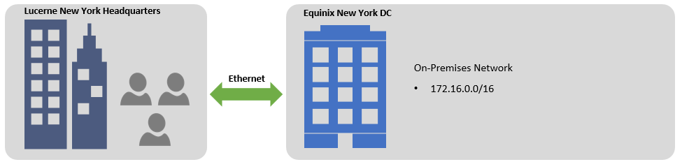

Lift and Shift

Whiteboard design session student guide

June 2018

Information in this document, including URL and other Internet Web site references, is subject to change without notice. Unless otherwise noted, the example companies, organizations, products, domain names, e-mail addresses, logos, people, places, and events depicted herein are fictitious, and no association with any real company, organization, product, domain name, e-mail address, logo, person, place or event is intended or should be inferred. Complying with all applicable copyright laws is the responsibility of the user. Without limiting the rights under copyright, no part of this document may be reproduced, stored in or introduced into a retrieval system, or transmitted in any form or by any means (electronic, mechanical, photocopying, recording, or otherwise), or for any purpose, without the express written permission of Microsoft Corporation.

Microsoft may have patents, patent applications, trademarks, copyrights, or other intellectual property rights covering subject matter in this document. Except as expressly provided in any written license agreement from Microsoft, the furnishing of this document does not give you any license to these patents, trademarks, copyrights, or other intellectual property.

The names of manufacturers, products, or URLs are provided for informational purposes only and Microsoft makes no representations and warranties, either expressed, implied, or statutory, regarding these manufacturers or the use of the products with any Microsoft technologies. The inclusion of a manufacturer or product does not imply endorsement of Microsoft of the manufacturer or product. Links may be provided to third party sites. Such sites are not under the control of Microsoft and Microsoft is not responsible for the contents of any linked site or any link contained in a linked site, or any changes or updates to such sites. Microsoft is not responsible for webcasting or any other form of transmission received from any linked site. Microsoft is providing these links to you only as a convenience, and the inclusion of any link does not imply endorsement of Microsoft of the site or the products contained therein.

© 2018 Microsoft Corporation. All rights reserved.

Microsoft and the trademarks listed at https://www.microsoft.com/en-us/legal/intellectualproperty/Trademarks/Usage/General.aspx are trademarks of the Microsoft group of companies. All other trademarks are property of their respective owners.

**Contents**

<!-- TOC -->

- [Lift and shift whiteboard design session student guide](#lift-and-shift-whiteboard-design-session-student-guide)
    - [Abstract and learning objectives](#abstract-and-learning-objectives)
    - [Step 1: Review the customer case study](#step-1-review-the-customer-case-study)
        - [Customer situation](#customer-situation)
        - [Customer needs](#customer-needs)
        - [Customer objections](#customer-objections)
        - [Infographic for common scenarios](#infographic-for-common-scenarios)
    - [Step 2: Design a proof of concept solution](#step-2-design-a-proof-of-concept-solution)
    - [Step 3: Present the solution](#step-3-present-the-solution)
    - [Wrap-up](#wrap-up)
    - [Additional references](#additional-references)

<!-- /TOC -->

#  Lift and shift whiteboard design session student guide

## Abstract and learning objectives 

In this workshop, students will help a global publisher architect a solution to migrate two on-premises applications into Azure. Because of the desire to not change the existing applications, this will involve moving the application and its dependencies onto Azure IaaS VMs, using other Azure services where appropriate. There are many questions and concerns the customer has, and they will look to the student to answer these and provide the end-state design and the high-level steps to get there with minimal end-user impact and risk

Attendees will be better able to migrate and enable easy deployment for
lift and shift capabilities. In addition, attendees will learn to:

-   Build and deploy complex infrastructure solutions with Azure
    Resource Manager templates

-   Work with Azure Automation Desired State Configuration (DSC) for
    deploying server configurations

-   Scale existing templatized deployments leveraging VM Scale Sets

## Step 1: Review the customer case study 

**Outcome** 

Analyze your customer’s needs.

Timeframe: 15 minutes 

Directions: With all participants in the session, the facilitator/SME presents an overview of the customer case study along with technical tips. 
1.  Meet your table participants and trainer 
2.  Read all of the directions for steps 1–3 in the student guide 
3.  As a table team, review the following customer case study

### Customer situation

Lucerne Publishing is one of the largest English-language publishers in
the world. With nearly 200 years of history, Lucerne has published some
of the world's foremost authors, including Nobel Prize, Pulitzer Prize,
National Book Award, Newbery Medal and Caldecott Medal winners. Lucerne
is consistently at the forefront of innovation, using digital technology
to create unique reading and viewing experiences and expand the reach of
its authors and documentary producers.

Lucerne is headquartered in New York City and has publishing groups in
the United States, United Kingdom, Canada, Australia and New Zealand.

Lucerne is starting a three-year project to move most of its data center
footprint to the cloud. "We are convinced that cloud implementations
will give us cost savings and more importantly, deliver operational
flexibility," says Greg Vernon, head of infrastructure and enterprise
operations at Lucerne. "Like every other business, we are under constant
pressure to do more with less. We believe that cloud computing will be
substantially cheaper over time than in-house data centers." Currently,
their workloads are hosted in an Equinix collocated data center near
Lucerne's New York office.

Lucerne has already completed a migration to Office 365. One of the key
steps that is complete was to use the Microsoft Azure Active Directory
(AD) Connect service to synchronize their Windows Server Active
Directory Domain users and groups to Azure AD. This enabled Single
Sign-On (SSO) to Office 365 and full synchronization of Azure AD and
their Local Active Directory.

With the successful migration to Office 365 behind them, Lucerne now
wants to pilot setting up the necessary network infrastructure 
to connect their environment with Microsoft, and migrating production
workloads to Azure.
They have chosen two existing on-premises applications to migrate to Azure
for this pilot - a procurement system and an HR application.
These have been selected in part for their diverse
requirements, to challenge the migration team and build confidence
for future migrations.

Lucerne would like to migrate both applications to Azure
with a minimal amount of changes. One of Greg's primary concerns with
Azure is around security. Greg wants to validate that only
members of the team who are responsible for a service have access to
that service. For instance, only the networking team should be able to
manage the connectivity to Azure, and only the infrastructure team
members responsible for a given application should be able to manage 
that application. Greg is also interested in other governance
features he can apply to ensure only supported workloads are being used
in their Azure subscription.

**Existing network architecture**

**Procurement system**

Jesse Adams is the infrastructure lead responsible for managing the
procurement system today. Per Jesse, they use VMware for their
virtualization managed using vCenter 6.0. The application is currently
deployed on four VMware VMs running Windows Server 2008 R2 with
Microsoft Internet Information Services (IIS) and ASP.NET with the .NET
Framework 3.5. The application install only supports a wizard-based
installation that installs several .NET assemblies that are deployed to
the global assembly cache (GAC). Authentication and authorization to the
application are based on the user's Windows user account and a specific
group in AD the user must belong to. The frontend web servers are load
balanced using an F5 load balancer with cookie affinity enabled, because
the application uses an in-memory session state. The web servers are
currently configured with two vCPUs, six GB of memory, and the VMware
host runs Xeon processors (Skylake). The hardware utilization is unknown
at this point in time.

The application itself is accessed by users on Lucerne's corporate
network via the URL https://procurement. Jesse is concerned about
security to the application and wants to restrict access to only
requests from the on-premises network.

The backend for this solution is hosted on a VMware VMs using SQL Server
2012 with Always On availability groups.
The solution makes heavy use of TempDB when
generating ad hoc reports. The database size for this workload is
around 600 GB. The prcurement system is a third-party component which is 
certified for use with all supported versions of SQL Server but not
with Azure SQL Database. SQL Server capitalizes on System
Center Data Protection Manager (DPM) 2012 R2 for regular backups
throughout the day to disk and the backups are then offloaded to tape
and eventually to offsite storage.

The database is deployed on VMs, and both are equipped with eight vCPUs
and 16 GB of memory running on the same VMware host. The hardware
utilization is unknown at this point in time. The hardware is due
for a refresh, and as such, this is a prime candidate for migration to
Azure. There are currently no plans for a significant change to the
underlying application code.

**Existing procurement solution**

**HR application**

Ellen Jones is the infrastructure lead responsible for managing the HR application.
She has described this as a legacy application, which Lucerne plan to replace
within the next 24 months.
Ellen's team is stretched and she is keen to minimize any on-going maintenance.

It is a two-tier applicaiton architecture, with the web tier running on Windows Server 2012 with 
Microsoft Internet Information Services (IIS) and ASP.NET with the .NET
Framework 4.5. This is implemented on two Dell PowerEdge servers,
with two 4-core Intel Xeon CPUs (Sandy Bridge) and 4GB memory. Both the OS and application
have been installed on the same drive, which has UEFI boot enabled.

The application is accessed via the internal network via the URL https://AskHR. It is open
to all staff, who are identified using their AD credentials. There have been requests to make
the application available from outside the corporate network, but due to security concerns
this has not yet been implemented.

The database backend runs on SQL Server 2005 in a failover cluster configuration.
The database design uses several T-SQL jobs scheduled using SQL Agent.
The database size for this workload is relatively small at just under 200 GB.
It runs on similar hardware to the web servers, except with 16GB memory and SSD disks.
The application has been tested to run with SQL Server 2017, and part of an earlier planned
upgrade Lucerne has already acquired licenses for SQL Server 2017 Enterprise Edition with
Software Assurance (SA).

The database contains highly sensitive HR information and must be accessible only
to the application tier. Lucerne are extremely concerned about this point and are looking for
a strong level of assurance that the database will not be accessible via any other means.

The application was written in-house using contract staff who are no longer available to the company.
No application installers are available. Ellen believes the original source code
is in an off-site backup archive, but fears that substantial effort would be required to locate
it and rebuild. Even the smallest code change represent a substantial challenge
and potential obstacle to migration.

**Existing HR application**

### Customer needs 

1.  Lucerne have asked you to assess each application for suitability and cost analysis
    before migrating to Azure

2.  The procurement system is a critical business application. Availability is required 24/7,
    including during migration

3.  The HR application is only used in office hours and a once-off 12-hour migration
    window can be made available

4.  Each migrated application must offer high availability even
    if a VM fails or during patching cycles
        
5.  Each migrated application must include backup/restore capabilities,
    for both web and database tiers

6.  Prior to cutting over production traffic, Lucerne should be able to
    perform a full test of the application running in Azure to ensure it
    is fully functional

7.  Lucerne demands there is a way to "fail back" if
    something goes wrong at any point in the migration process

8.  Both applications are Intranet applications. Lucerne requires connectivity
    from their corporate network to be robust, secure and performant.

1.  All Azure deployments must support least-privilige access controls and protections to ensure production resources cannot be modified or deleted without authorization or by accident
    
2.  Mechanisms must be in place to control and monitor Azure cost and prevent
    use of unapproved Azure services

### Customer objections 

1.  How can we tell how much we will really be spending once we have
    migrated to Azure?

2.  Moving the procurement system to the cloud seems like a security problem. It
    should only be accessible from people at Lucerne's offices.

3.  We already have licenses for SQL Server. We do not want to pay for
    them again.

4.  Our operations team is new to the cloud and currently uses existing
    technologies like System Center Operations Manager (SCOM). We are
    concerned about the time it takes to learn new technologies to
    monitor and maintain an existing workload.

5.  The sun never sets on Lucerne Publishing. Logistics and procurement
    is one of our most critical applications. Any glitch will cause
    havoc in our ecosystem. The procurement system migration must be
    seamless, with no loss of data and no application downtime.

### Infographic for common scenarios

## Step 2: Design a proof of concept solution

**Outcome** 

Design a solution and prepare to present the solution to the target customer audience in a 15-minute chalk-talk format. 

Timeframe: 60 minutes

**Business needs**

Directions: With all participants at your table, answer the following questions and list the answers on a flip chart. 
1.  Who should you present this solution to? Who is your target customer audience? Who are the decision makers? 
2.  What customer business needs do you need to address with your solution?

**Design** 
Directions: With all participants at your table, respond to the following questions on a flip chart.

_Networking and Security_

1.  Which peering options and other ExpressRoute features would be
    required?

2.  Can you identify the workflow that Lucerne will need to follow to
    enable ExpressRoute in its environment?

3.  The networking team has provided the following
    address space for creating the virtual network: 10.0.1.0/24. The
    on-premises network uses the following address space: 172.16.0.0/16.
    By drawing a diagram, what connectivity options and subnets would
    you use for the network design?

4.  What additional security measures can you take to minimize the
    attack surface of each application at the network level?

5.  What does Lucerne need to do to allow isolated access to different
    components of Azure? Specifically, your design should allow the
    network infrastructure team to manage the virtual network, the
    procurement infrastructure team to manage the procurement
    infrastructure, and the HR team to manage the HR application.

6.  How can Lucerne control and monitor their Azure spend?

_Migration - Procurement system_

1.  What options are available to assess the procurement system for suitability
    to migrating to Azure, and to forecast Azure costs?

2.  Which compute stack would you recommend for the web tier, keeping in
    mind that the configuration of the application will essentially be
    the same (supporting cookie affinity, etc.)? 

3.  Which data storage option and pricing tier would you recommend for
    the database?

4.  What migration approach (including tools and steps) would you use to
    move the workload to Microsoft Azure?

5.  How long will the migration take to synchronize data, for each tier?
    (Feel free to state any assumptions you need to make.)

6.  How does the design perform user authentication?

7.  How is load balancing configured in the migrated workload?

8.  How does the design achieve high availability?

9.  How are all the VMs backed up?

10.  How is the database backed up? Can you remove the dependency on tape for offsite backup?

_Migration - HR application_

1.  What options are available to assess the HR application for suitability
    to migrating to Azure, and to forecast Azure costs?

2.  Which compute stack would you recommend for the web tier?

3.  Which data storage option and pricing tier would you recommend for the database?

4.  What migration approach (including tools and steps) would you use to
    move the workload to Microsoft Azure? Keep in mind the physical server specifications
    and that application installers are not available.

5.  How are high availability and backup provided, for both web and database tiers?

6.  How does your design meet Lucerne's database security requirements?

7.  What additional benefits can your design bring?

**Prepare**

Directions: With all participants at your table:

1.  Identify any customer needs that are not addressed with the proposed solution 
2.  Identify the benefits of your solution
3.  Determine how you will respond to the customer’s objections.

## Step 3: Present the solution

**Outcome**
 
Present a solution to the target customer audience in a 15-minute chalk-talk format.

Timeframe: 30 minutes

**Presentation** 

Directions:
1.  Pair with another table
2.  One table is the Microsoft team and the other table is the customer
3.  The Microsoft team presents their proposed solution to the customer
4.  The customer makes one of the objections from the list of objections
5.  The Microsoft team responds to the objection
6.  The customer team gives feedback to the Microsoft team.
7.  Tables switch roles and repeat Steps 2–6

## Wrap-up 

Timeframe: 15 minutes

Directions: Tables reconvene with the larger group to hear the facilitator/SME share the preferred solution for the case study.

##  Additional references

|    |            |       
|----------|:-------------:|
| **Description** | **Links** |
| Azure Backup documentation | <https://azure.microsoft.com/en-us/documentation/services/backup/> |
| ExpressRoute Routing requirements| <https://azure.microsoft.com/en-us/documentation/articles/expressroute-routing/> |
| ExpressRoute workflows | <https://azure.microsoft.com/en-us/documentation/articles/expressroute-workflows/> |
| Virtual Network documentation | <https://azure.microsoft.com/en-us/documentation/services/virtual-network/> |
| Install AD Replica in Azure | <https://azure.microsoft.com/en-us/documentation/articles/virtual-networks-install-replica-active-directory-domain-controller/> |
| Operations Management Suite | <https://azure.microsoft.com/en-us/updates/announcing-microsoft-operations-management-suite/> |
| Site-to-Site VPN documentation | <https://azure.microsoft.com/en-us/documentation/services/vpn-gateway/> |
| ExpressRoute documentation | <https://azure.microsoft.com/en-us/documentation/services/expressroute/> |
| Application Gateway documentation | <https://azure.microsoft.com/en-us/documentation/services/application-gateway/> |
| Azure Migration Hub | https://azure.microsoft.com/migration/ |
| Prepare for Azure Site Recovery deployment | <https://azure.microsoft.com/en-us/documentation/articles/site-recovery-best-practices/> |
| Replicate VMware virtual machines and physical servers to Azure with Azure Site Recovery | <https://azure.microsoft.com/en-us/documentation/articles/site-recovery-vmware-to-azure-classic/> |
| Azure Site Recovery Service URLs | <https://azure.microsoft.com/en-us/documentation/articles/site-recovery-best-practices/#service-urls/> |
| Azure Migrate Documentation | <https://docs.microsoft.com/en-us/azure/migrate/> |
| Database Migration Service | <https://azure.microsoft.com/en-us/services/database-migration/> |
| Database Migration Assistant | <<https://docs.microsoft.com/en-us/sql/dma/dma-overview/> |
| Azure blog - Migrating to Azure SQL Database with zero downtime for read-only workloads | https://azure.microsoft.com/blog/migrating-to-azure-sql-database-with-zero-downtime-for-read-only-workloads/ |
| Azure blog - Azure Backup for SQL Server on Azure now in public preview |  https://azure.microsoft.com/en-us/blog/azure-backup-for-sql-server-on-azure-vm-public-preview/  |
| StarWind V2V Converter | https://www.starwindsoftware.com/converter/> |
| CloudEndure | https://www.cloudendure.com/ |
